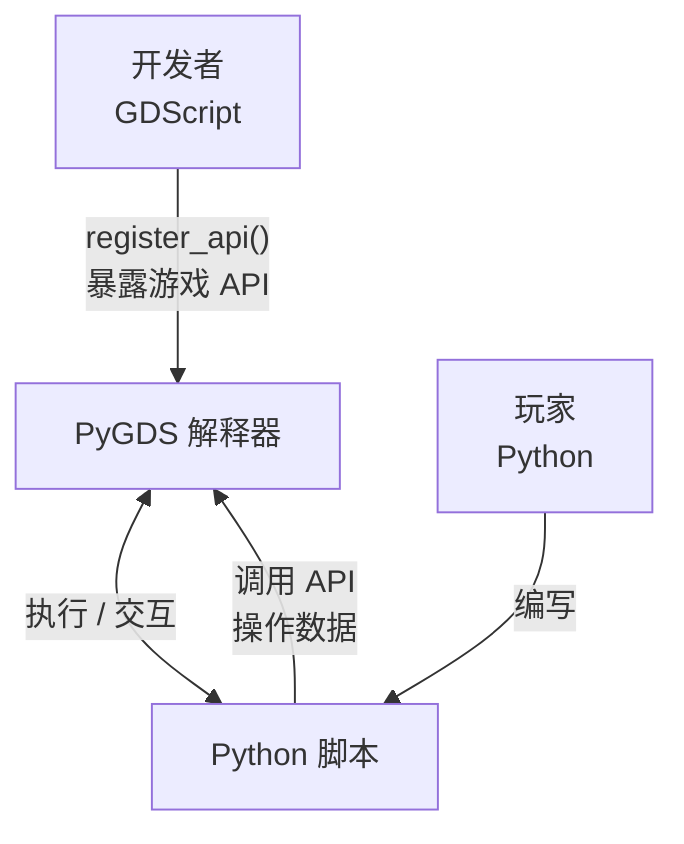

# PyGDS — Python 运行时模拟器 for Godot

使用 GDScript 实现的 Python 3.x 子集解释器，让 Godot 引擎能在所有支持 GDScript 的平台上运行类 Python 代码

> If you need to read the English document, please visit [README_EN.md](./README_EN.md)

---

## 设计定位

PyGDS 是一个嵌入式脚本引擎，**不是 GDScript 的替代品**

它的使用场景是：**让 “玩家” 使用 Python 语法与游戏世界进行高级数据与行为交互**，由 “开发者” 通过 `register_api()` 将游戏系统的 API 暴露给脚本调用



**PyGDS 做什么：**

- 为游戏提供 Python 语法的脚本能力（变量、函数、类、控制流、异常）
- 让非开发者用熟悉的 Python 语法操作游戏数据、配置游戏逻辑
- 作为模组系统的脚本引擎，让玩家编写自定义行为

**PyGDS 不做什么：**

- 替代 GDScript 开发游戏核心逻辑 — 核心逻辑仍用 GDScript
- 提供完整的 Python 标准库 — 只提供 `str`/`list`/`dict` 等基础类型和少量内置函数
- 支持 `import`/模块系统 — 脚本是独立的单文件
- 支持 `async`/`await`/`yield` — 游戏脚本交互是同步的，但提供了挂起系统

---

## 快速开始

PyGDS 是一个 GDScript 类，继承自 `Node`

使用时先实例化，再通过 `write_dsl_script()` 传入代码，最后调用 `run()` 执行

```gdscript
extends Node

func _ready() -> void:
    var dsl = PyGDS.new()

    # 非 debug 模式下终端输出不会打印到 Godot 控制台
    dsl.set_debug_mode(true)

    dsl.write_dsl_script("""
print("Hello, PyGDS!")
info("这是一条 INFO 日志")
warn("这是一条 WARN 日志")
""")
    dsl.run()

    # 获取终端输出与日志
    print(dsl.print_output)
    print(dsl.console_output)

    # 调整日志级别
    dsl.set_log_level(PyGDS.ConsoleReport.Level.WARN)
    print(dsl.console_output)  # 仅保留 WARN 及以上级别
```

---

## 安装与集成

PyGDS 提供两种集成方式：

### 方式一：单文件集成（推荐）

PyGDS 的全部核心代码位于单个文件 [pygds.gd](./pygds.gd) 中，无外部依赖

1. 将 `pygds.gd` 复制到你的 Godot 项目目录（任意位置，建议项目根目录）
2. 文件顶部的 `class_name PyGDS` 会自动注册为全局类，无需额外配置
3. 即可通过 `PyGDS.new()` 或 `load("res://pygds.gd").new()` 使用

```gdscript
var dsl = PyGDS.new()
dsl.write_dsl_script("print('Hello!')")
dsl.run()
```

### 方式二：作为编辑器插件（可选）

项目自带的 [addons/pygds](./addons/pygds/) 提供了一个编辑器插件，在 `Project > Tools` 菜单增加「Run PyGDS Script...」动作，可直接选择并运行项目内的 `.py` 脚本，输出打印到编辑器控制台

1. 将 `addons/pygds/` 目录复制到你的项目（依赖根目录的 `pygds.gd`）
2. 在 Godot 编辑器中打开 **项目设置 → 插件**，启用 **PyGDS**

> 插件的核心仍是单文件的 `pygds.gd`，编辑器插件仅为开发便利

---

## Python 兼容性矩阵

| 特性 | 支持程度 | 说明 |
| :--- | :--- | :--- |
| 变量赋值 | ✅ 完整 | 支持普通赋值、多重赋值、解包赋值 |
| 整数 (`int`) | ✅ 完整 | 含加减乘除、取模、幂运算等所有运算符 |
| 浮点数 (`float`) | ✅ 完整 | 同 `int` 的运算符支持 |
| 字符串 (`str`) | ✅ 完整 | 含 `upper`/`lower`/`split`/`join` 等常用方法 |
| 列表 (`list`) | ✅ 完整 | 含 `append`/`extend`/`pop`/`sort` 等所有方法 |
| 元组 (`tuple`) | ✅ 完整 | 不可变序列 |
| 字典 (`dict`) | ✅ 完整 | 含 `items`/`keys`/`values`/`get`/`pop` 等 |
| 布尔 (`bool`) | ✅ 完整 | `True`/`False`/`None` 单例 |
| `if`/`elif`/`else` 语句 | ✅ 完整 | 含三目运算符 (`a if cond else b`) |
| `while` 循环 | ✅ 完整 | 含 `break`/`continue` |
| `for` 循环 | ✅ 完整 | 支持列表/元组/字符串/字典遍历 |
| 函数定义 | ✅ 完整 | 含普通函数、默认参数、`*args`、`**kwargs` |
| 类定义 | ✅ 完整 | 含继承、方法覆写、实例属性 |
| 静态方法 | ✅ 完整 | `@staticmethod` 装饰器 |
| 类方法 | ✅ 完整 | `@classmethod` 装饰器 |
| 异常处理 | ✅ 完整 | 含 `try`/`except`/`else`/`finally`/`raise`、自定义异常类 |
| `is` / `is not` | ✅ 完整 | 身份运算符 |
| `id()` | ✅ 完整 | 对象标识符 |
| `global`/`nonlocal` | ✅ 完整 | 变量作用域声明 |
| 列表推导式 | ✅ 完整 | `[x for x in iterable [if cond]]` |
| 生成器表达式 | ✅ 完整 | `(x for x in iterable [if cond])`，惰性生成器，支持 `next()` 与 `sum(x for x in ...)` 裸写法 |
| 字典推导式 | ✅ 完整 | `{k: v for k, v in ... [if cond]}` |
| 集合推导式 | ✅ 完整 | `{x*x for x in iterable [if cond]}` |
| 多 `for` 推导式 | ✅ 完整 | `[x*y for x in a for y in b]`，每个 `for` 可带多个 `if`；列表/字典/集合推导式与生成器表达式均支持，循环变量可为 `k, v` 元组目标 |
| 字面量 `*` 解包 | ✅ 完整 | `[*a, *b]` / `[1, *mid, 2]` / `(*a,)` / `{*a, 1}`（Python 3.5+） |
| 赋值表达式 (`:=`) | ✅ 完整 | `if (n := len(a)) > 5:`、`while chunk := read():`、推导式内绑定到外层作用域（Python 3.8+）；与 CPython 一致地拒绝「重绑定推导式循环变量」与「出现在推导式可迭代表达式内」两种写法 |
| `slice` | ✅ 完整 | `slice(start, stop[, step])` 对象，可复用索引 `lst[slice(...)]` |
| 增强赋值 | ✅ 完整 | `+=`, `-=`, `*=`, `/=` 等 |
| 下标访问 | ✅ 完整 | `obj[key]` 含 `getitem`/`setitem`；切片赋值/删除 `a[1:3] = [9]` / `del a[1:3]` |
| 属性访问 | ✅ 完整 | `obj.attr` 含 `getattr`/`setattr` |
| 方法类型系统 | ✅ 完整 | 六种类型严格对标 CPython |
| Descriptor 协议 | ✅ 完整 | `__get__` 实现类级/实例级绑定 |
| 魔法方法 | ✅ 完整 | `__add__`/`__str__`/`__init__` 等类级注册 |
| 运算符 | ✅ 完整 | 二元/一元/比较/增强赋值全部支持 |
| f-string | ✅ 完整 | `f"value: {x:.2f}"`，含格式说明符、转换标志、`=` 调试符与嵌套格式宽度 |
| lambda | ✅ 完整 | 匿名函数，支持默认参数与闭包 |
| `super()` | ✅ 完整 | 单继承下调用父类方法/构造函数 |
| `getattr`/`setattr`/`delattr`/`hasattr` | ✅ 完整 | 内置反射函数 |
| `map()`/`filter()` | ✅ 完整 | 内置函数式工具 |
| 运行时错误行号 | ✅ 完整 | 未捕获异常附带 `(line N)` |
| 数字字面量 | ✅ 完整 | `0x1F` / `0o17` / `0b101` / `1_000_000` / `1e5`；`int("ff", 16)` 按进制解析 |
| 调用处 `*`/`**` 解包 | ✅ 完整 | `f(*args)` / `f(**kwargs)` |
| 字典合并 | ✅ 完整 | `d1 \| d2` / `d1 \|= d2` / `{**a, **b}`（Python 3.9+） |
| `str` `%` 格式化 | ✅ 完整 | `"%s: %d" % (x, y)`（printf 风格） |
| `str.format` | ✅ 完整 | `"{:.2f} {:>8}".format(x, s)`，含位置/关键字参数与格式说明符 |
| 内置模块 | ✅ 完整 | `import math` / `from math import sqrt`（含 math/random/statistics/functools/itertools/collections/string/operator/time；math 含 comb/perm/prod/lcm/cbrt/remainder，random 含 choices/gauss，statistics 含 quantiles，functools 含 cmp_to_key，itertools 含 repeat/cycle/count/zip_longest/takewhile/dropwhile/accumulate/pairwise/groupby/starmap，operator 提供运算符函数与 itemgetter/attrgetter，time 提供 sleep/time/time_ns/monotonic/perf_counter） |
| `set` | ✅ 完整 | 字面量 `{1, 2}`、构造、集合运算与方法 |
| `frozenset` | ✅ 完整 | 不可变集合，可哈希，支持集合运算与比较 |
| `bytes` 类型 | ✅ 完整 | `b"xy"` 字面量与 `bytes()` 构造（整数零填充 / 可迭代 / 字符串编码 / 拷贝）；方法族 `decode` / `hex` / `upper` / `lower` / `title` / `strip` 家族 / `split` / `replace` / `find` / `index` / `count` / `startswith` / `endswith` / `join` / `center` / `ljust` / `rjust`；索引/迭代产出整数、切片、重复、`in`，与 `str` 严格区分 |
| `range` 类型 | ✅ 完整 | 独立的惰性 `range` 对象，支持 `len` / 索引 / 切片 / 成员判定 / 迭代，大范围不展开内存 |
| 多重赋值目标 | ✅ 完整 | `a[0], a[2] = a[2], a[0]`、`o.x, o.y = 1, 2`，含链式后缀 `self.data[k] = v` |
| `dict` 视图 | ✅ 完整 | `keys()` / `values()` 可迭代且有 `len` 与 `in` |
| 多继承 | ❌ 不支持 | 仅支持单继承 |
| `async`/`await` | ❌ 不支持 | 仅作为保留关键字识别：`await` 的位置与 `async for` / `async with` / `async` 误用会按 CPython 报对应 `SyntaxError` |
| 生成器/`yield` | ✅ 完整 | 生成器函数（`def` 内含 `yield`），调用返回惰性 `generator` 对象，函数体不立即执行；支持语句级与表达式级 `yield`、`yield from` 委托、`send` 注入、`throw` / `close`（`GeneratorExit`）、`StopIteration.value`（生成器 `return` 值）、生成器方法、lambda 生成器（Python 3.12+）、多生成器交替与嵌套（含嵌套生成器内 `time.sleep()`）、`yield from` 的 `send` / `throw` 完整委托（PEP 380，子生成器优先捕获）、闭包跨 `yield` 保持 |
| 装饰器 | ⚠️ 部分 | `@staticmethod` / `@classmethod` / `@property`（含 getter/setter/deleter） |
| `with` 语句 | ❌ 不支持 | — |
| 用户文件 `import` | ❌ 不支持 | 仅支持内置模块（math/random/statistics/functools/itertools/collections/string/operator/time） |

> **⚠️ 破坏性变更（v0.3.0）**：生成器表达式 `(x for x in iterable)` 的语义已从「急切求值为列表」改为「惰性生成器对象」
> 旧代码若直接对生成器表达式结果做下标/`len()`/列表方法会报错，需先 `list(g)` / `tuple(g)` 转换
> 生成器为一次性迭代器，重复迭代不会从头开始
>
> **⚠️ 破坏性变更（v0.4.0）**：`yield` 现为保留关键字，不能再用作变量名/函数名等标识符（此前可当普通标识符用）；若旧代码以 `yield` 命名变量，需改名
>
> **⚠️ 破坏性变更（v0.5.0-alpha.1）**：`sleep()` 已迁移到 `time` 模块，须 `import time` 后用 `time.sleep(n)` 调用；裸 `sleep()` 不再存在（与 CPython 一致，CPython 也没有内置的裸 `sleep`）
>
> **⚠️ 破坏性变更（v0.5.0-alpha.4）**：`async` / `await` 现为保留关键字，不能再用作变量名/函数名等标识符（此前可当普通标识符用）；同时 `return` / `break` / `continue` 出现在函数体外或循环体会报 `SyntaxError`（此前被静默忽略）；若旧代码以 `async` / `await` 命名变量，需改名
>
> 已知的行为差异与功能缺失（含 `yield` 恢复重复求值、`send` / `throw` 不转发、多重赋值目标、用户类迭代协议等）已移至下方「已知问题与限制」章节

---

## 已知问题与限制

以下列出 PyGDS 当前与 CPython 不一致、或尚未实现的行为。**P0 = 静默错值**（最危险，优先修复）、**P1 = 明确报错或功能缺失**、**P2 = 边缘差异**

### P0 — 静默错值

v0.5.0-alpha.5 收尾时发现的 10 条 P0 级缺陷（P0-3 ~ P0-12：嵌套容器相等判定、负数整除取模、转义序列解码、序列排序、`min`/`max` 的 `key`、切片 `del`、`repr(None)`、`chr()`/`%c` 越界、format 分组、`iter(list)` 活动视图）已**全部在 v0.5.0-alpha.6 修复**，详见 `CHANGELOG` 的对应版本节

### P1 — 明确报错或功能缺失

下列 P1-1 ~ P1-6、P1-11、P1-14、P1-16 ~ P1-18 已在 v0.5.0-alpha.3 ~ v0.5.0-alpha.5 修复；v0.5.0-alpha.5 收尾时新发现的 P1-19 ~ P1-29（括号内换行、单行复合语句、`try`/`else`、切片赋值、genexpr 元组元素、用户类下标与转换协议、序列大小比较、`None` 字典键、`iter()` 类型名、`hasattr`）已**全部在 v0.5.0-alpha.6 修复**，详见 `CHANGELOG` 的对应版本节

| 编号 | 问题 | 说明 |
| :--- | :--- | :--- |
| P1-7 | `with` 语句不支持 | 按既定范围当前不实现 |
| P1-8 | 用户文件 `import` 不支持 | 按既定范围当前不实现；仅支持内置模块（math / random / statistics / functools / itertools / collections / string / operator / time） |
| P1-9 | `async` / `await` 不支持 | 按既定范围当前不实现；异步场景以挂起系统（`time.sleep` / `request_suspend_waiting`）替代。作为保留字，`async` / `await` 的误用现按 CPython 报 `SyntaxError` |
| P1-10 | `match` / `case` 结构化模式匹配不支持 | 延后至 v0.6.0 |
| P1-13 | `yield` 恢复时前缀子表达式可能重复求值 | 已在 v0.5.0-alpha.3 修复常见形态（按节点 + 出现次序记忆），v0.5.0-alpha.4 修复同族迭代上限，v0.5.0-alpha.5 修复「同一语句内普通 `yield` 与 `yield from` 交替」的重复产出。残留：同一语句内多个「结构等值」的调用仍会互相认错帧（取值与等待次数正确，副作用条数偏多），彻底解决需要表达式级续延 |

### P2 — 边缘差异

| 编号 | 问题 | 说明 |
| :--- | :--- | :--- |
| P2-1 | `random` 随机序列与 CPython 不同 | PyGDS 使用自有 xorshift32 PRNG，抽样结果数值不同（参数类型规则已对齐，`seed()` 保证 PyGDS 内部可复现） |
| P2-2 | 部分语法错误文案不同 | `async` / `await` / `return` / `break` / `continue` 的误用文案与「语句尾部冗余 Token」已对齐；括号未闭合的文案已在 **v0.5.0-alpha.6** 对齐（`'(' was never closed`）。其余解析期错误的措辞与行号格式仍可能不同（如缺冒号、未结束字符串） |
| P2-4 | `hash` 数值与 CPython 不同 | PyGDS 对 `hash(None)` 等使用稳定哈希值，CPython 为进程相关的随机化哈希；仅数值本身不同，等值对象的哈希相等性等语义一致 |

### 平台限制

| 限制 | 说明 |
| :--- | :--- |
| str 字面量不支持 NUL 字符 | Godot 的 String 无法保存 U+0000（会被替换为 U+FFFD），因此 `'\x00'` / `'\0'` 等 str 转义在解码时明确报 `SyntaxError`；bytes 侧不受影响（`b'\x00'` 正常） |
| `\N{名称}` 仅支持内置名称表 | Godot 无 Unicode 名称数据库；PyGDS 内置 ASCII 可打印字符全名与常用符号约 200 条（如 `\N{BULLET}'、`\N{LATIN CAPITAL LETTER A}'），表外名称按 CPython 语义报 `SyntaxError: unknown Unicode character name` |

---

## 架构概览

PyGDS 实现了一条完整的解释器管线：

```txt
源码 (Python-like) → Lexer → Parser → AST → Interpreter → 执行
```

***核心组件***

| 组件 | 职责 |
| :--- | :--- |
| **Lexer（词法分析器）** | 将源码字符串扫描为 Token 流，识别关键字、标识符、字面量、运算符等 |
| **Parser（语法分析器）** | 递归下降解析器，将 Token 流构建为抽象语法树（AST） |
| **Interpreter（解释器）** | 遍历 AST 节点并逐条执行，管理作用域与运行时状态 |
| **DSLObject 体系** | 多种运行时对象类型，所有对象继承自 DSLObject，通过 `klass` 字段实现统一类型查找（对标 CPython `PyObject.ob_type`）。`fields` 字典（对应 Python `__dict__`，`null` = 内置类型无 `__dict__`）实现实例属性存储，"万物皆对象"的 Python 语义 |
| **DSLClass** | 类系统，支持继承、方法覆写、`@staticmethod`、`@classmethod`。DSLObject 直接作为实例（无需 DSLInstance 中间层），内置 `_dsl_*`（内部快速通道）、`magic_*`（DSL 魔法方法协议）、`builtin_*`（DSL 内置方法）三层命名规范 |
| **PyGDS** | 主控制器，汇集 Lexer/Parser/Interpreter，提供对外 API |

---

## API 注册

PyGDS 支持将 GDScript 函数注册为 PyGDS 脚本中可调用的全局函数，通过 `register_api()` 实现

```gdscript
extends Node

func _ready() -> void:
    var dsl = PyGDS.new()
    dsl.set_debug_mode(true)

    dsl.register_api({
        "my_func": func(args, kwargs):
            return PyGDS.DSLString.new("hello from GDScript!")
    })

    dsl.write_dsl_script("""
result = my_func()
print(result)
""")
    dsl.run()
```

`register_api()` 接收一个 `Dictionary`，键为函数名称（字符串），值为 `Callable`，注册后的函数可以在 PyGDS 脚本中直接按名称调用

---

## 挂起系统

PyGDS 提供了挂起（Suspend）机制，允许 DSL 脚本在执行过程中暂停，等待外部条件满足后恢复。这是 PyGDS 区别于标准 Python 的独有特性，适用于游戏中的延时、等待玩家输入、播放动画等场景

挂起分为两种类型：

| 类型 | 调用方法 | 适用范围 | 恢复方式 |
| :--- | :--- | :--- | :--- |
| SLEEPING | DSL 内部调用 `time.sleep(n)`，API 函数调用 `request_suspend_sleeping()` | 已知等待时间 | Timer 超时后自动调用 `run()` 恢复 |
| WAITING | API 函数调用 `request_suspend_waiting()` | 等待时间不确定 | 外部设置 `state = RUNNING` 后调用 `run()` |

`run()` 方法返回 `State` 枚举值（`FINISHED` / `SUSPENDED_SLEEPING` / `SUSPENDED_WAITING` / `ERROR`），外部代码根据返回值驱动后续执行流程

```gdscript
var dsl = PyGDS.new()

# SLEEPING 挂起通过 SceneTree.create_timer 自动恢复
# 如需在恢复时执行额外逻辑, 可设置 _sleeping_resume_callback
# (该回调在 run() 恢复执行前调用, Timer 始终调用 run(), 回调仅用于附加逻辑)

# WAITING 挂起通过注册 API 函数调用 request_suspend_waiting() 触发
dsl.register_api_pair("wait_for_confirm", func(_args, _kwargs):
    dsl.request_suspend_waiting()
)

dsl.write_dsl_script("""
import time
print("开始")
time.sleep(1.0)
print("1 秒后继续")
wait_for_confirm()
print("手动恢复后继续")
""")

var state = dsl.run()
# state == PyGDS.State.SUSPENDED_SLEEPING, 等待 Timer 超时
# Timer 超时后自动调用 run(), 遇到 wait_for_confirm() 返回 SUSPENDED_WAITING
# 外部设置 dsl.state = PyGDS.State.RUNNING 后调用 dsl.run() 继续
```

---

## 行为测试

[py_package](./py_package/) 包内含有 [tests](./py_package/tests/) 文件夹以及 [test.py](./py_package/test.py) 文件，运行该文件后，将对 [tests](./py_package/tests/) 文件夹内的所有 Python 文件进行调用，并获取控制台输出，根据 `OUTPUT_FILE` 变量获取保存地址（默认为 `./expected.json`）

该 json 文件结构为 `{"测试项目名": {"source": "对应源代码", "expected": "控制台输出结果或编译报错结果"}}`

您可以使用

```cmd
godot --headless --path /你的项目路径 --script /pygds路径/test.gd
```

运行 gdscript 测试文件，以确保 PyGDS 行为是否与 Python 一致

### 新增测试与重新生成 expected.json

向 [tests](./py_package/tests/) 添加新的 `*.py` 测试文件后，需要将真实 Python 的输出记录到 `expected.json`：

```cmd
cd py_package
python test.py
```

> **注意**：`expected.json` 是**人工整理**的基线文件。`test.py` 会全量重写它，其中个别用例（如 `edge_str_repr` 的对象内存地址）需要手动规范化为 `<OnlyStr object>` 形式。因此建议：运行 `test.py` 后**只把新增用例的 `expected` 合并进现有文件**，保留原有已整理条目，再运行 `test.gd` 验证

---

## Demo 测试

`demo/` 目录下包含一些完整的演示场景，在 Godot 编辑器中打开场景文件即可运行

---

## 常见问题 FAQ

### 如何从文件加载脚本？

推荐将 DSL 代码写入独立的 `.py` 文件（避免 GDScript 字符串的转义与 Tab 缩进问题），运行时读取并执行：

```gdscript
func run_script_file(path: String) -> void:
    var file = FileAccess.open(path, FileAccess.READ)
    var source = file.get_as_text()
    file.close()
    dsl.write_dsl_script(source)
    dsl.run()
```

### 如何让脚本与场景/节点交互？

通过 `register_api()` 将节点或游戏逻辑暴露给脚本。API 函数在 GDScript 端定义，可捕获外部变量（如节点引用）：

```gdscript
dsl.register_api_pair("move_player", func(args, _kwargs):
    var dx = args[0]._dsl_str()
    player.position.x += float(dx)   # player 为脚本外捕获的节点引用
    return PyGDS.DSLNone.new(),
)
```

脚本端调用 `move_player(10)` 即可操作场景节点

### 为什么 `print()` 在 Godot 控制台看不到输出？

非调试模式下输出不会实时打印到控制台，而是累积到 `dsl.print_output`。调用 `dsl.set_debug_mode(true)` 可让 `print()` 直接输出到控制台

### 脚本能读取玩家输入或网络数据吗？

可以。通过 `register_api()` 把 GDScript 侧的能力暴露给脚本；需要等待的异步场景通过挂起系统实现（`time.sleep` / `request_suspend_waiting`），而非 Python 的 `async/await`

---

## 详细文档

| 文档 | 说明 |
| :--- | :--- |
| [architecture.md](docs/zh-CN/architecture.md) | 架构详解与执行流程 |
| [method_type_system.md](docs/zh-CN/method_type_system.md) | 方法类型系统（对标 CPython） |
| [class_system.md](docs/zh-CN/class_system.md) | 类与实例系统 |
| [builtin_types.md](docs/zh-CN/builtin_types.md) | 内置类型详解 |
| [exception_system.md](docs/zh-CN/exception_system.md) | 异常系统 |
| [usage.md](docs/zh-CN/usage.md) | 使用指南与 API 注册 |
