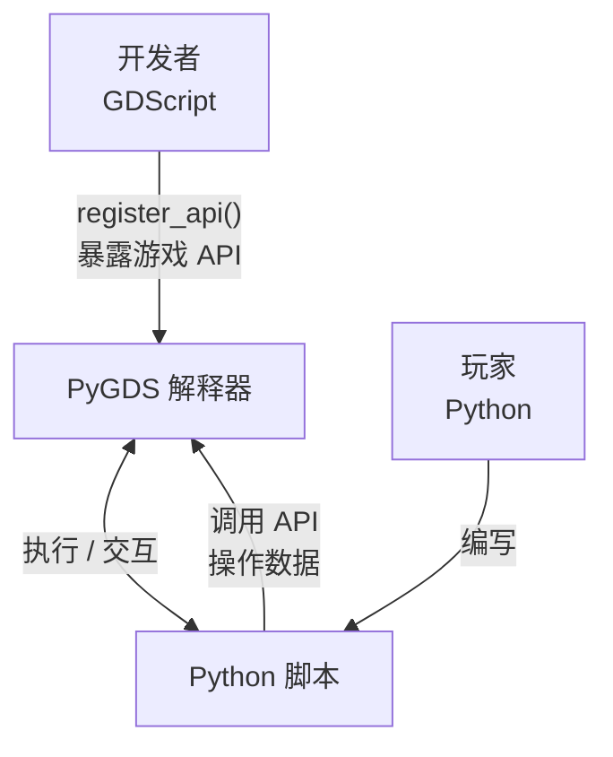

# PyGDS — Python 运行时模拟器 for Godot

使用 GDScript 实现的 Python 3.x 子集解释器，让 Godot 引擎能在所有支持 GDScript 的平台上运行类 Python 代码

> If you need to read the English document, please visit [README_EN.md](./README_EN.md)

---

## 设计定位

PyGDS 是一个嵌入式脚本引擎，**不是 GDScript 的替代品**

它的使用场景是：**让 “玩家” 使用 Python 语法与游戏世界进行高级数据与行为交互**，由 “开发者” 通过 `register_api()` 将游戏系统的 API 暴露给脚本调用



**PyGDS 做什么：**

- 为游戏提供 Python 语法的脚本能力（变量、函数、类、控制流、异常）
- 让非开发者用熟悉的 Python 语法操作游戏数据、配置游戏逻辑
- 作为模组系统的脚本引擎，让玩家编写自定义行为

**PyGDS 不做什么：**

- 替代 GDScript 开发游戏核心逻辑 — 核心逻辑仍用 GDScript
- 提供完整的 Python 标准库 — 只提供 `str`/`list`/`dict` 等基础类型和少量内置函数
- 支持 `import`/模块系统 — 脚本是独立的单文件
- 支持 `async`/`await`/`yield` — 游戏脚本交互是同步的，但提供了挂起系统

---

## 快速开始

PyGDS 是一个 GDScript 类，继承自 `Node`

使用时先实例化，再通过 `write_dsl_script()` 传入代码，最后调用 `run()` 执行

```gdscript
extends Node

func _ready() -> void:
    var dsl = PyGDS.new()

    # 非 debug 模式下终端输出不会打印到 Godot 控制台
    dsl.set_debug_mode(true)

    dsl.write_dsl_script("""
print("Hello, PyGDS!")
info("这是一条 INFO 日志")
warn("这是一条 WARN 日志")
""")
    dsl.run()

    # 获取终端输出与日志
    print(dsl.print_output)
    print(dsl.console_output)

    # 调整日志级别
    dsl.set_log_level(PyGDS.ConsoleReport.Level.WARN)
    print(dsl.console_output)  # 仅保留 WARN 及以上级别
```

---

## Python 兼容性矩阵

| 特性 | 支持程度 | 说明 |
| :--- | :--- | :--- |
| 变量赋值 | ✅ 完整 | 支持普通赋值、多重赋值、解包赋值 |
| 整数 (`int`) | ✅ 完整 | 含加减乘除、取模、幂运算等所有运算符 |
| 浮点数 (`float`) | ✅ 完整 | 同 `int` 的运算符支持 |
| 字符串 (`str`) | ✅ 完整 | 含 `upper`/`lower`/`split`/`join` 等常用方法 |
| 列表 (`list`) | ✅ 完整 | 含 `append`/`extend`/`pop`/`sort` 等所有方法 |
| 元组 (`tuple`) | ✅ 完整 | 不可变序列 |
| 字典 (`dict`) | ✅ 完整 | 含 `items`/`keys`/`values`/`get`/`pop` 等 |
| 布尔 (`bool`) | ✅ 完整 | `True`/`False`/`None` 单例 |
| `if`/`elif`/`else` 语句 | ✅ 完整 | 含三目运算符 (`a if cond else b`) |
| `while` 循环 | ✅ 完整 | 含 `break`/`continue` |
| `for` 循环 | ✅ 完整 | 支持列表/元组/字符串/字典遍历 |
| 函数定义 | ✅ 完整 | 含普通函数、默认参数、`*args`、`**kwargs` |
| 类定义 | ✅ 完整 | 含继承、方法覆写、实例属性 |
| 静态方法 | ✅ 完整 | `@staticmethod` 装饰器 |
| 类方法 | ✅ 完整 | `@classmethod` 装饰器 |
| 异常处理 | ✅ 完整 | 含 `try`/`except`/`finally`/`raise`、自定义异常类 |
| `is` / `is not` | ✅ 完整 | 身份运算符 |
| `id()` | ✅ 完整 | 对象标识符 |
| `global`/`nonlocal` | ✅ 完整 | 变量作用域声明 |
| 列表推导式 | ✅ 完整 | `[x for x in iterable [if cond]]` |
| 生成器表达式 | ⚠️ 部分 | `(x for x in iterable [if cond])` |
| 字典推导式 | ✅ 完整 | `{k: v for k, v in ... [if cond]}` |
| 增强赋值 | ✅ 完整 | `+=`, `-=`, `*=`, `/=` 等 |
| 下标访问 | ✅ 完整 | `obj[key]` 含 `getitem`/`setitem` |
| 属性访问 | ✅ 完整 | `obj.attr` 含 `getattr`/`setattr` |
| 方法类型系统 | ✅ 完整 | 六种类型严格对标 CPython |
| Descriptor 协议 | ✅ 完整 | `__get__` 实现类级/实例级绑定 |
| 魔法方法 | ✅ 完整 | `__add__`/`__str__`/`__init__` 等类级注册 |
| 运算符 | ✅ 完整 | 二元/一元/比较/增强赋值全部支持 |
| 多继承 | ❌ 不支持 | 仅支持单继承 |
| `async`/`await` | ❌ 不支持 | — |
| 生成器/`yield` | ❌ 不支持 | — |
| 装饰器 | ⚠️ 部分 | `@staticmethod` / `@classmethod` / `@property`（含 getter/setter/deleter） |
| `with` 语句 | ❌ 不支持 | — |
| 模块/`import` | ❌ 不支持 | — |
| 集合 (`set`) | ❌ 不支持 | — |

---

## 架构概览

PyGDS 实现了一条完整的解释器管线：

```txt
源码 (Python-like) → Lexer → Parser → AST → Interpreter → 执行
```

***核心组件***

| 组件 | 职责 |
| :--- | :--- |
| **Lexer（词法分析器）** | 将源码字符串扫描为 Token 流，识别关键字、标识符、字面量、运算符等 |
| **Parser（语法分析器）** | 递归下降解析器，将 Token 流构建为抽象语法树（AST） |
| **Interpreter（解释器）** | 遍历 AST 节点并逐条执行，管理作用域与运行时状态 |
| **DSLObject 体系** | 多种运行时对象类型，所有对象继承自 DSLObject，通过 `klass` 字段实现统一类型查找（对标 CPython `PyObject.ob_type`）。`fields` 字典（对应 Python `__dict__`，`null` = 内置类型无 `__dict__`）实现实例属性存储，"万物皆对象"的 Python 语义 |
| **DSLClass** | 类系统，支持继承、方法覆写、`@staticmethod`、`@classmethod`。DSLObject 直接作为实例（无需 DSLInstance 中间层），内置 `_dsl_*`（内部快速通道）、`magic_*`（DSL 魔法方法协议）、`builtin_*`（DSL 内置方法）三层命名规范 |
| **PyGDS** | 主控制器，汇集 Lexer/Parser/Interpreter，提供对外 API |

---

## API 注册

PyGDS 支持将 GDScript 函数注册为 PyGDS 脚本中可调用的全局函数，通过 `register_api()` 实现

```gdscript
extends Node

func _ready() -> void:
    var dsl = PyGDS.new()
    dsl.set_debug_mode(true)

    dsl.register_api({
        "my_func": func(args, kwargs):
            return PyGDS.DSLString.new("hello from GDScript!")
    })

    dsl.write_dsl_script("""
result = my_func()
print(result)
""")
    dsl.run()
```

`register_api()` 接收一个 `Dictionary`，键为函数名称（字符串），值为 `Callable`，注册后的函数可以在 PyGDS 脚本中直接按名称调用

---

## 挂起系统

PyGDS 提供了挂起（Suspend）机制，允许 DSL 脚本在执行过程中暂停，等待外部条件满足后恢复。这是 PyGDS 区别于标准 Python 的独有特性，适用于游戏中的延时、等待玩家输入、播放动画等场景

挂起分为两种类型：

| 类型 | 调用方法 | 适用范围 | 恢复方式 |
| :--- | :--- | :--- | :--- |
| SLEEPING | DSL 内部调用 `sleep(n)`，API 函数调用 `request_suspend_sleeping()` | 已知等待时间 | Timer 超时后自动调用 `run()` 恢复 |
| WAITING | API 函数调用 `request_suspend_waiting()` | 等待时间不确定 | 外部设置 `state = RUNNING` 后调用 `run()` |

`run()` 方法返回 `State` 枚举值（`FINISHED` / `SUSPENDED_SLEEPING` / `SUSPENDED_WAITING` / `ERROR`），外部代码根据返回值驱动后续执行流程

```gdscript
var dsl = PyGDS.new()

# SLEEPING 挂起通过 SceneTree.create_timer 自动恢复
# 如需在恢复时执行额外逻辑, 可设置 _sleeping_resume_callback
# (该回调在 run() 恢复执行前调用, Timer 始终调用 run(), 回调仅用于附加逻辑)

# WAITING 挂起通过注册 API 函数调用 request_suspend_waiting() 触发
dsl.register_api_pair("wait_for_confirm", func(_args, _kwargs):
    dsl.request_suspend_waiting()
)

dsl.write_dsl_script("""
print("开始")
sleep(1.0)
print("1 秒后继续")
wait_for_confirm()
print("手动恢复后继续")
""")

var state = dsl.run()
# state == PyGDS.State.SUSPENDED_SLEEPING, 等待 Timer 超时
# Timer 超时后自动调用 run(), 遇到 wait_for_confirm() 返回 SUSPENDED_WAITING
# 外部设置 dsl.state = PyGDS.State.RUNNING 后调用 dsl.run() 继续
```

---

## 行为测试

[py_package](./py_package/) 包内含有 [tests](./py_package/tests/) 文件夹以及 [test.py](./py_package/test.py) 文件，运行该文件后，将对 [tests](./py_package/tests/) 文件夹内的所有 Python 文件进行调用，并获取控制台输出，根据 `OUTPUT_FILE` 变量获取保存地址（默认为 `./expected.json`）

该 json 文件结构为 `{"测试项目名": {"source": "对应源代码", "expected": "控制台输出结果或编译报错结果"}}`

您可以使用

```cmd
godot --headless --path /你的项目路径 --script /pygds路径/test.gd
```

运行 gdscript 测试文件，以确保 PyGDS 行为是否与 Python 一致

---

## Demo 测试

`demo/` 目录下包含一些完整的演示场景，在 Godot 编辑器中打开场景文件即可运行

---

## 详细文档

| 文档 | 说明 |
| :--- | :--- |
| [architecture.md](docs/zh-CN/architecture.md) | 架构详解与执行流程 |
| [method_type_system.md](docs/zh-CN/method_type_system.md) | 方法类型系统（对标 CPython） |
| [class_system.md](docs/zh-CN/class_system.md) | 类与实例系统 |
| [builtin_types.md](docs/zh-CN/builtin_types.md) | 内置类型详解 |
| [exception_system.md](docs/zh-CN/exception_system.md) | 异常系统 |
| [usage.md](docs/zh-CN/usage.md) | 使用指南与 API 注册 |
