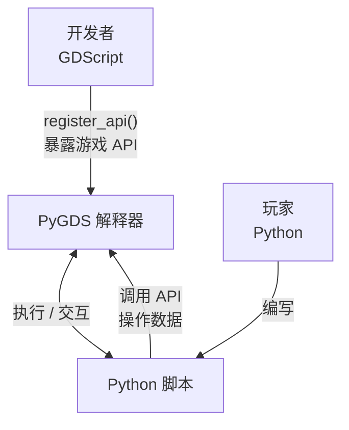

# PyGDS — Python 运行时模拟器 for Godot

使用 GDScript 实现的 Python 3.x 子集解释器，让 Godot 引擎能在所有支持 GDScript 的平台上运行类 Python 代码

> If you need to read the English document, please visit [README_EN.md](./README_EN.md)

---

## 设计定位

PyGDS 是一个嵌入式脚本引擎，**不是 GDScript 的替代品**

它的使用场景是：**让 “玩家” 使用 Python 语法与游戏世界进行高级数据与行为交互**，由 “开发者” 通过 `register_api()` 将游戏系统的 API 暴露给脚本调用


```mermaid
flowchart TD
    A[开发者<br>GDScript] -->|"register_api()<br>暴露游戏 API"| B[PyGDS 解释器]
    B <-->|执行 / 交互| C[Python 脚本]
    C -->|调用 API<br>操作数据| B
    D[玩家<br>Python] -->|编写| C
```

**PyGDS 做什么：**

- 为游戏提供 Python 语法的脚本能力（变量、函数、类、控制流、异常、生成器、推导式、模式匹配）
- 让非开发者用熟悉的 Python 语法操作游戏数据、配置游戏逻辑
- 作为模组系统的脚本引擎：盘符沙箱内多文件 mod、用户模块 `import`、宿主 API 注册

**PyGDS 不做什么：**

- 替代 GDScript 开发游戏核心逻辑 — 核心逻辑仍用 GDScript
- 提供完整的 CPython 标准库 — 内置若干个常用模块，其余标准库模块未实现
- 实现 CPython 的包 / 命名空间包与 C 扩展模块加载 — 用户模块按 `sys.path` 逐目录解析单文件 `<name>.py`
- 提供事件循环与并发运行时（`asyncio` 等）— `async` / `await` 以协程对象模拟（同步方式驱动），游戏内等待以挂起系统替代

---

## 快速开始

PyGDS 是一个 GDScript 类，继承自 `Node`

使用时先实例化，再通过 `write_dsl_script()` 传入代码，最后调用 `run()` 执行

```gdscript
extends Node

func _ready() -> void:
    var dsl = PyGDS.new()

    # 非 debug 模式下终端输出不会打印到 Godot 控制台
    dsl.set_debug_mode(true)

    dsl.write_dsl_script("""
print("Hello, PyGDS!")
info("这是一条 INFO 日志")
warn("这是一条 WARN 日志")
""")
    dsl.run()

    # 获取终端输出与日志
    print(dsl.print_output)
    print(dsl.console_output)

    # 调整日志级别
    dsl.set_log_level(PyGDS.ConsoleReport.Level.WARN)
    print(dsl.console_output)  # 仅保留 WARN 及以上级别
```

---

## 安装与集成

PyGDS 提供以下集成方式：

### 单文件集成

PyGDS 的全部核心代码位于单个文件 [pygds.gd](./pygds.gd) 中，无外部依赖

1. 将 `pygds.gd` 复制到你的 Godot 项目目录（任意位置，建议项目根目录）
2. 文件顶部的 `class_name PyGDS` 会自动注册为全局类，无需额外配置
3. 即可通过 `PyGDS.new()` 或 `load("res://pygds.gd").new()` 使用

```gdscript
var dsl = PyGDS.new()
dsl.write_dsl_script("print('Hello!')")
dsl.run()
```

### 盘符虚拟沙箱（可选）

需要脚本读写文件或加载盘内模块时，实例化时传入盘符与访问开关，脚本可见空间收敛到 `user://<base_path>/<盘符>/`，对真实文件系统零接触，具体实现详见 [usage.md#盘符虚拟沙箱](docs/zh-CN/usage.md#盘符虚拟沙箱)

```gdscript
var dsl = PyGDS.new("MOD1", true)
dsl.write_dsl_script("print(open('data.txt').read())")
dsl.run()

dsl.load_dsl_script("main.py")   # 从盘符读取主文件 (多文件 mod 场景)
dsl.run()
```

---

## Python 兼容性矩阵

本表为支持程度概览，各特性的详细语法与语义见 [usage.md#DSL 语法参考](docs/zh-CN/usage.md#dsl-语法参考)

支持程度标记说明：

- ✅ 完整 = 行为与 CPython 一致
- 🟡 子集 = 仅实现务实子集，有明确限制
- 🔵 接受 = 语法接受，语义忽略或模拟
- ❌ 缺失 = 解析或运行时直接报错

| 特性 | 支持程度 | 说明 |
| :--- | :--- | :--- |
| **基础语法与运算符** | | |
| 运算符 | ✅ 完整 | 二元/一元/比较/增强赋值全部支持 |
| 变量赋值 | ✅ 完整 | 普通/多重/解包/增强赋值与赋值表达式（`:=`） |
| 多重赋值目标 | ✅ 完整 | 下标/属性/键目标与链式后缀 |
| 下标访问 | ✅ 完整 | 下标读写与切片赋值/删除 |
| 属性访问 | ✅ 完整 | `obj.attr` 读写 |
| `is` / `is not` | ✅ 完整 | 身份运算符 |
| `id()` | ✅ 完整 | 对象标识符 |
| `global` / `nonlocal` | ✅ 完整 | 变量作用域声明 |
| **内置标量类型** | | |
| 整数 (`int`) | ✅ 完整 | 含全部运算符与数字字面量（任意精度） |
| 浮点数 (`float`) | ✅ 完整 | 同 `int` 的运算符支持 |
| 复数 (`complex`) | ✅ 完整 | 含 `1j` 字面量、构造、算术、比较与字典键 |
| 布尔 (`bool`) | ✅ 完整 | `True`/`False`/`None` 单例 |
| 字符串 (`str`) | ✅ 完整 | 含常用方法与 `%` / `format` / `f-string` 格式化 |
| 字节串 (`bytes`) | ✅ 完整 | 字面量/构造与全部方法族 |
| 字节数组 (`bytearray`) | ✅ 完整 | 可变字节序列，含构造与方法 |
| 内存视图 (`memoryview`) | 🟡 子集 | 一维 B 格式视图（只读/可写透传） |
| **容器类型** | | |
| 列表 (`list`) | ✅ 完整 | 含 `append`/`extend`/`pop`/`sort` 等常用方法 |
| 元组 (`tuple`) | ✅ 完整 | 不可变序列 |
| 范围 (`range`) | ✅ 完整 | 独立惰性序列（`len`/索引/切片/迭代） |
| 字典 (`dict`) | ✅ 完整 | 含常用方法与 `\|` 合并（Python 3.9+） |
| 字典视图 (`dict_keys` / `dict_values` / `dict_items`) | ✅ 完整 | 实时视图（迭代、`len` 与成员判定） |
| 集合 (`set`) | ✅ 完整 | 字面量、构造、集合运算与方法 |
| 冻结集合 (`frozenset`) | ✅ 完整 | 不可变集合，可哈希 |
| 切片 (`slice`) | ✅ 完整 | 可复用的切片对象与索引 |
| **控制流** | | |
| `if`/`elif`/`else` 语句 | ✅ 完整 | 含三目运算符 |
| `while` 循环 | ✅ 完整 | 含 `break`/`continue` |
| `for` 循环 | ✅ 完整 | 支持列表/元组/字符串/字典遍历 |
| `match`/`case` 模式匹配 | ✅ 完整 | 软关键字，全部模式形态与编译期检查 |
| **函数与闭包** | | |
| 函数定义 | ✅ 完整 | 含全部参数形态与匿名函数（`lambda`） |
| 推导式 | ✅ 完整 | 列表/生成器/字典/集合推导式（含多 `for` 与裸写法） |
| `*`、`**` 解包 | ✅ 完整 | 字面量与调用处解包 |
| 装饰器 | ✅ 完整 | 任意表达式装饰器与 `@staticmethod` / `@classmethod` / `@property` 等内建形式 |
| 生成器 / `yield` | ✅ 完整 | 生成器函数与 `yield` / `yield from` / `send` / `throw` / `close` |
| **面向对象** | | |
| 类定义 | ✅ 完整 | 含继承（多继承）、覆写、类/静态方法与魔法方法 |
| `super()` | ✅ 完整 | 沿 MRO 调用父类方法/构造函数 |
| 方法类型系统 | ✅ 完整 | 方法/描述符类型对标 CPython |
| Descriptor 协议 | ✅ 完整 | `__get__` 实现类级/实例级绑定 |
| `getattr`/`setattr`/`delattr`/`hasattr` | ✅ 完整 | 内置反射函数 |
| 泛型类型参数与 `type` 别名 | 🔵 接受 | PEP 695 语法接受（忽略类型语义） |
| **异常处理** | | |
| 异常处理 | ✅ 完整 | 含 `try`/`except`/`else`/`finally`/`raise`、自定义异常与异常组（PEP 654） |
| `raise ... from` 异常链 | ✅ 完整 | `__cause__` / `__suppress_context__` |
| **内置函数** | | |
| `map()` / `filter()` | ✅ 完整 | 惰性迭代器（CPython 同形） |
| **模块与导入** | | |
| 内置模块 | 🟡 子集 | 内置 `math` / `random` / `time` 等常用模块，完整列表见 [builtin.md#内置模块](docs/zh-CN/builtin.md#内置模块-import) |
| 用户文件 `import` | ✅ 完整 | `sys.path` 逐目录解析 `<name>.py` |
| `__name__` / `__file__` | ✅ 完整 | 含入口守卫与 `set_script_path()` 注入 |
| **文件与上下文** | | |
| `open()` 文件 I/O | 🟡 子集 | 文本/二进制文件对象（`r`/`w`/`a`/`rb`/`wb`/`ab`） |
| `with` 语句 | ✅ 完整 | 上下文管理器协议（含 `contextlib`） |
| **异步** | | |
| `async` / `await` | 🟡 子集 | 协程对象模拟（`async def` / `await` / `async for` / `async with` / 异步生成器，同步驱动，无事件循环） |
| **运行时与调试** | | |
| 运行时错误行号 | ✅ 完整 | 未捕获异常附带 `(line N)` |

> **⚠️ 破坏性变更（v0.3.0）**：生成器表达式 `(x for x in iterable)` 的语义已从「急切求值为列表」改为「惰性生成器对象」
> 旧代码若直接对生成器表达式结果做下标/`len()`/列表方法会报错，需先 `list(g)` / `tuple(g)` 转换
> 生成器为一次性迭代器，重复迭代不会从头开始
>
> **⚠️ 破坏性变更（v0.4.0）**：`yield` 现为保留关键字，不能再用作变量名/函数名等标识符（此前可当普通标识符用）；若旧代码以 `yield` 命名变量，需改名
>
> **⚠️ 破坏性变更（v0.5.0-alpha.1）**：`sleep()` 已迁移到 `time` 模块，须 `import time` 后用 `time.sleep(n)` 调用；裸 `sleep()` 不再存在（与 CPython 一致，CPython 也没有内置的裸 `sleep`）
> **⚠️ 破坏性变更（v0.5.0-alpha.4）**：`async` / `await` 现为保留关键字，不能再用作变量名/函数名等标识符（此前可当普通标识符用）；同时 `return` / `break` / `continue` 出现在函数体外或循环体会报 `SyntaxError`（此前被静默忽略）；若旧代码以 `async` / `await` 命名变量，需改名
>
> **⚠️ 破坏性变更（v0.6.0-alpha.2）**：异常对象的 `str(e)` 改为返回消息文本（此前为异常类型名，无参为空串），`repr(e)` 为 `TypeName('msg')` 格式，`e.args` 返回参数元组；`type` 变为类对象（`print(type)` 输出 `<class 'type'>`）；`dir()` 无参仅返回用户定义名，内置类型实例返回方法名列表
>
> **⚠️ 破坏性变更（v0.8.0-alpha.1）**：`with` 现为保留关键字，不能再用作变量名/函数名等标识符（此前可当普通标识符用）；若旧代码以 `with` 命名变量，需改名

---

## 已知差异与限制

以下列出 PyGDS 当前与 CPython 的已知差异与限制，按成因分为三系：**Issue（I 编号，语言核心对齐缺口）**、**Design（D 编号，有意的替代模型）**、**Platform（P 编号，宿主平台限制）**。Issue 按优先级分级：**I0 = 静默错值**（最危险，优先修复）、**I1 = 明确报错或功能缺失**、**I2 = 边缘差异**

### 语言核心差异（Issue）

（当前无未处理条目：原 I1-80 用户类 `__del__` 已并入 P5，原 I2-74 字符分类已实现全码段对齐、未分配码位残余并入 P4）

### 设计层差异（Design）

| 编号 | 内容 | 说明 |
| :--- | :--- | :--- |
| D2 | `hash` 数值与 CPython 不同（默认稳定模型） | PyGDS 对 `hash(None)` 等默认使用稳定哈希值（进程间可复现），CPython 为进程随机化哈希；等值对象的哈希相等性等语义一致。已提供对齐开关：`run()` 前设 `stable_identity_hash = false` 即对齐 CPython 3.12 的进程随机化语义 |
| D3 | 默认步数上限 50000 | 超限报 `RuntimeError: maximum step count exceeded`（`yield from` 深递归等长脚本会触顶，CPython 无此限）；宿主可经 `_config_max_steps` 调整，属安全阀设计 |
| D5 | CPython 3.11+ 的 4300 位 int 与 str 转换上限未模拟 | CPython 的 `int_max_str_digits` 是其自身 DoS 防护；PyGDS 任意精度整数不设该限（有意模型） |
| D6 | 内置模块 repr 标 (built-in) | PyGDS 将 `random` / `statistics` / `functools` / `itertools` / `collections` / `contextlib` / `string` / `operator` 全部实现为 GDScript 内置模块，repr 为 `<module 'x' (built-in)>`；CPython 对应模块为 .py 文件，repr 为 `<module 'x' from '...py'>`（对 PyGDS 实为内置，非缺陷） |
| D7 | 用户模块 repr 的 from 'path' 用脚本可见路径 | 用户模块 `repr` 的源路径取脚本可见形态：沙箱内为盘符相对路径（如 `<module 'm' from 'MOD1:/m.py'>`），不暴露 `user://` 真实路径；CPython 为绝对路径（沙箱设计的既定正确行为） |

### 平台层差异（Platform）

| 编号 | 内容 | 说明 |
| :--- | :--- | :--- |
| P2 | 引擎 VM 调用栈 2048 帧硬上限 | 深递归叠加深表达式时引擎以 `Stack overflow` 硬中止调用链，PyGDS 静默丢失后续输出（CPython 可正常完成或抛出可捕获的 `RecursionError`）；表达式求值/解析的 GDScript 帧深不受调用深度约束 |
| P3 | str 字面量不支持 NUL 字符 | Godot 的 String 无法保存 U+0000（会被替换为 U+FFFD），因此 `'\x00'` / `'\0'` 等 str 转义在解码时明确报 `SyntaxError`；bytes 侧不受影响（`b'\x00'` 正常） |
| P4 | Unicode 名称与字符分类数据库缺失 | Godot 无 Unicode 名称与赋值数据库。`\N{名称}` 内置 ASCII 可打印字符全名与常用符号名称表，表外按 CPython 语义报 `SyntaxError: unknown Unicode character name`；`isdecimal` / `isdigit` / `isnumeric` / `isspace` 已内置 Nd / No / Nl / Zs 全码位区间表对齐 CPython，`isprintable` 对未分配 (Cn) 码位按可打印处理（无赋值数据库判定） |
| P5 | 对象回收回调不可驱动（生成器隐式 close 与用户类 `__del__`） | Godot 4.x 的 `NOTIFICATION_PREDELETE` 触发时脚本实例已 detach，引用计数回收路径无法驱动生成器 `finally` 或用户类 `__del__`（alpha.8 批次二实测与 I1-80 同根源，理论修复路径被否定）；需要清理逻辑的代码应显式 `close()`；Godot 升级若松动应复核 |
| P6 | 引擎退出检查对全局类脚本资源图的滞留告警 | 内嵌类方法体内的自引用构造（类 X 体内 `X.new()`）使引擎退出时不释放脚本核心类图并告警；触发构造已于 v0.8.0-alpha.9 经跨类工厂规避（退出告警清零），新增内嵌类应避免该形态；引擎升级若松动应复核 |

---

## 架构概览

PyGDS 实现了一条完整的解释器管线：

```txt
源码 (Python-like) → Lexer → Parser → AST → Interpreter → 执行
```

***核心组件***

| 组件 | 职责 |
| :--- | :--- |
| **Lexer（词法分析器）** | 将源码字符串扫描为 Token 流，识别关键字、标识符、字面量、运算符等 |
| **Parser（语法分析器）** | 递归下降解析器，将 Token 流构建为抽象语法树（AST） |
| **Interpreter（解释器）** | 遍历 AST 节点并逐条执行，管理作用域与运行时状态 |
| **DSLObject 体系** | 多种运行时对象类型，所有对象继承自 DSLObject，通过 `klass` 字段实现统一类型查找（对标 CPython `PyObject.ob_type`）。`fields` 字典（对应 Python `__dict__`，`null` = 内置类型无 `__dict__`）实现实例属性存储，"万物皆对象"的 Python 语义 |
| **DSLClass** | 类系统，支持继承、方法覆写、`@staticmethod`、`@classmethod`。DSLObject 直接作为实例（无需 DSLInstance 中间层），内置 `_dsl_*`（内部快速通道）、`magic_*`（DSL 魔法方法协议）、`builtin_*`（DSL 内置方法）命名规范 |
| **PyGDS** | 主控制器，汇集 Lexer/Parser/Interpreter，提供对外 API |

---

## API 注册

PyGDS 支持将 GDScript 函数注册为 PyGDS 脚本中可调用的全局函数，通过 `register_api()` 实现

```gdscript
extends Node

func _ready() -> void:
    var dsl = PyGDS.new()
    dsl.set_debug_mode(true)

    dsl.register_api({
        "my_func": func(args, kwargs):
            return PyGDS.DSLString.new("hello from GDScript!")
    })

    dsl.write_dsl_script("""
result = my_func()
print(result)
""")
    dsl.run()
```

`register_api()` 接收一个 `Dictionary`，键为函数名称（字符串），值为 `Callable`，注册后的函数可以在 PyGDS 脚本中直接按名称调用

---

## 挂起系统

PyGDS 提供了挂起（Suspend）机制，允许 DSL 脚本在执行过程中暂停，等待外部条件满足后恢复。这是 PyGDS 区别于标准 Python 的独有特性，适用于游戏中的延时、等待玩家输入、播放动画等场景

挂起分为以下类型：

| 类型 | 调用方法 | 适用范围 | 恢复方式 |
| :--- | :--- | :--- | :--- |
| SLEEPING | DSL 内部调用 `time.sleep(n)`，API 函数调用 `request_suspend_sleeping()` | 已知等待时间 | Timer 超时后自动调用 `run()` 恢复 |
| WAITING | API 函数调用 `request_suspend_waiting()` | 等待时间不确定 | 外部设置 `state = RUNNING` 后调用 `run()` |

`run()` 方法返回 `State` 枚举值（`FINISHED` / `SUSPENDED_SLEEPING` / `SUSPENDED_WAITING` / `ERROR`），外部代码根据返回值驱动后续执行流程

```gdscript
var dsl = PyGDS.new()

# SLEEPING 挂起通过 SceneTree.create_timer 自动恢复
# 如需在恢复时执行额外逻辑, 可设置 _sleeping_resume_callback
# (该回调在 run() 恢复执行前调用, Timer 始终调用 run(), 回调仅用于附加逻辑)

# WAITING 挂起通过注册 API 函数调用 request_suspend_waiting() 触发
dsl.register_api_pair("wait_for_confirm", func(_args, _kwargs):
    dsl.request_suspend_waiting()
)

dsl.write_dsl_script("""
import time
print("开始")
time.sleep(1.0)
print("1 秒后继续")
wait_for_confirm()
print("手动恢复后继续")
""")

var state = dsl.run()
# state == PyGDS.State.SUSPENDED_SLEEPING, 等待 Timer 超时
# Timer 超时后自动调用 run(), 遇到 wait_for_confirm() 返回 SUSPENDED_WAITING
# 外部设置 dsl.state = PyGDS.State.RUNNING 后调用 dsl.run() 继续
```

---

## 行为测试

行为测试采用**双端实时比对**：每次运行现场执行 CPython 与 PyGDS 各一次，按用例声明的比对语义判定两端行为是否一致（`same_output` 逐字比对 stdout / `same_exception` 比对异常类 / `same_error` 比对异常类与消息）。全部用例位于 [ci/cases](./ci/cases/)，一个 `.py` 文件对应一个职责——如 `module_math_sqrt` 测 `math.sqrt` 一个函数、`comprehension_list` 测列表推导式，文件名即职责说明

- 判定矩阵、命名注册表、用例书写规范与新增用例流程见 [`docs/zh-CN/ci.md`](docs/zh-CN/ci.md)
- 每个用例的逐例说明见 [docs/zh-CN/behavioral.md](./docs/zh-CN/behavioral.md)

```cmd
godot --headless --path /你的项目路径 --script /pygds路径/ci/run_cases.gd
```

运行器自动探测 CPython 命令（Windows 先 `python`，Linux 先 `python3`），双端比对需要本机安装有 CPython

### 新增测试

向 [ci/cases](./ci/cases/) 添加用例后，运行 `python ci/lint_cases.py` 会提示补全文档条目；完整流程（头注格式 → lint → 补 behavioral.md 条目 → 过滤单跑 → 全量回归）见 [ci.md#新增用例流程](docs/zh-CN/ci.md#新增用例流程)

---

## Demo 测试

`demo/` 目录下包含挂起系统演示场景（`demo.tscn`）与挂起、盘符沙箱的独立测试套件（`test_suspend_all.gd`、`test_sandbox.gd`——PyGDS 特有能力无 CPython 参照端，以套件内自持期望判定）；前者在 Godot 编辑器中打开即可运行，后者经命令行执行：

```cmd
godot --headless --path /你的项目路径 --script /pygds路径/demo/test_suspend_all.gd

godot --headless --path /你的项目路径 --script /pygds路径/demo/test_sandbox.gd
```

---

## 常见问题 FAQ

### 如何从文件加载脚本？

推荐将 DSL 代码写入独立的 `.py` 文件（避免 GDScript 字符串的转义与 Tab 缩进问题）。常规方式是宿主自行读取后经 `write_dsl_script` 传入；实例化时传入盘符（如 `PyGDS.new("MOD1", true)`）后可直接经 `load_dsl_script` 从沙箱盘符读取，多文件 mod 场景配合盘内 `import` 使用：

```gdscript
func run_script_file(path: String) -> void:
    var file = FileAccess.open(path, FileAccess.READ)
    var source = file.get_as_text()
    file.close()
    dsl.write_dsl_script(source)
    dsl.run()

# 盘符沙箱方式: 主文件与模块文件位于 user://<base_path>/<盘符>/ 内
var dsl = PyGDS.new("MOD1", true)
dsl.load_dsl_script("main.py")
dsl.run()
```

脚本可见路径的收敛规则见 [usage.md#盘符虚拟沙箱](docs/zh-CN/usage.md#盘符虚拟沙箱)

### 如何让脚本与场景/节点交互？

通过 `register_api()` 将节点或游戏逻辑暴露给脚本。API 函数在 GDScript 端定义，可捕获外部变量（如节点引用）：

```gdscript
dsl.register_api_pair("move_player", func(args, _kwargs):
    var dx = args[0]._dsl_str()
    player.position.x += float(dx)   # player 为脚本外捕获的节点引用
    return PyGDS.DSLNone.new(),
)
```

脚本端调用 `move_player(10)` 即可操作场景节点

### 为什么 `print()` 在 Godot 控制台看不到输出？

非调试模式下输出不会实时打印到控制台，而是累积到 `dsl.print_output`。调用 `dsl.set_debug_mode(true)` 可让 `print()` 直接输出到控制台

### 脚本能读取玩家输入或网络数据吗？

可以。通过 `register_api()` 把 GDScript 侧的能力暴露给脚本；游戏内的等待场景建议通过挂起系统实现（`time.sleep` / `request_suspend_waiting`）——`async`/`await` 语法本身已支持（协程对象同步驱动），但无事件循环，不适合作为并发方案

---

## 详细文档

| 文档 | 说明 |
| :--- | :--- |
| [architecture.md](docs/zh-CN/architecture.md) | 架构详解与执行流程 |
| [method_type_system.md](docs/zh-CN/method_type_system.md) | 方法类型系统（对标 CPython） |
| [class_system.md](docs/zh-CN/class_system.md) | 类与实例系统 |
| [builtin_types.md](docs/zh-CN/builtin_types.md) | 内置类型详解 |
| [exception_system.md](docs/zh-CN/exception_system.md) | 异常系统 |
| [behavioral.md](docs/zh-CN/behavioral.md) | 行为一致性测试逐例说明 |
| [differences.md](docs/zh-CN/differences.md) | 与 CPython 的差异清单（Issue / Design / Platform 三系） |
| [usage.md](docs/zh-CN/usage.md) | 使用指南与 API 注册 |
