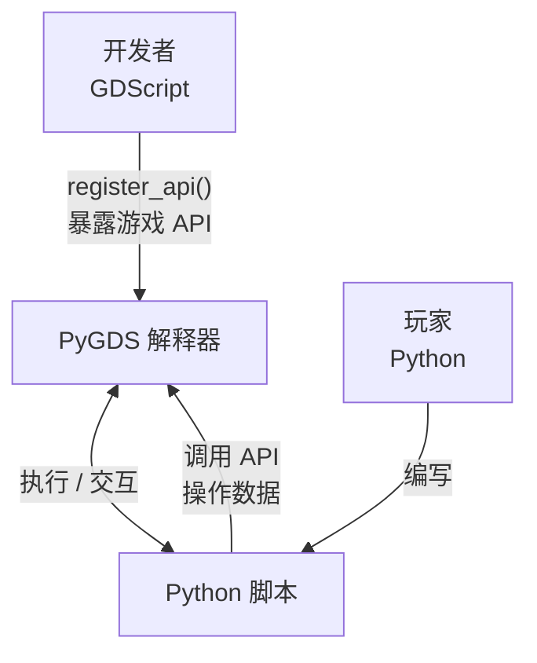

# PyGDS — Python 运行时模拟器 for Godot

使用 GDScript 实现的 Python 3.x 子集解释器，让 Godot 引擎能在所有支持 GDScript 的平台上运行类 Python 代码

> If you need to read the English document, please visit [README_EN.md](./README_EN.md)

---

## 设计定位

PyGDS 是一个嵌入式脚本引擎，**不是 GDScript 的替代品**

它的使用场景是：**让 “玩家” 使用 Python 语法与游戏世界进行高级数据与行为交互**，由 “开发者” 通过 `register_api()` 将游戏系统的 API 暴露给脚本调用


```mermaid
flowchart TD
    A[开发者<br>GDScript] -->|"register_api()<br>暴露游戏 API"| B[PyGDS 解释器]
    B <-->|执行 / 交互| C[Python 脚本]
    C -->|调用 API<br>操作数据| B
    D[玩家<br>Python] -->|编写| C
```

**PyGDS 做什么：**

- 为游戏提供 Python 语法的脚本能力（变量、函数、类、控制流、异常）
- 让非开发者用熟悉的 Python 语法操作游戏数据、配置游戏逻辑
- 作为模组系统的脚本引擎，让玩家编写自定义行为

**PyGDS 不做什么：**

- 替代 GDScript 开发游戏核心逻辑 — 核心逻辑仍用 GDScript
- 提供完整的 Python 标准库 — 只提供 `str`/`list`/`dict` 等基础类型和少量内置函数
- 支持 `import`/模块系统 — 脚本是独立的单文件
- 支持 `async`/`await`/`yield` — 游戏脚本交互是同步的，但提供了挂起系统

---

## 快速开始

PyGDS 是一个 GDScript 类，继承自 `Node`

使用时先实例化，再通过 `write_dsl_script()` 传入代码，最后调用 `run()` 执行

```gdscript
extends Node

func _ready() -> void:
    var dsl = PyGDS.new()

    # 非 debug 模式下终端输出不会打印到 Godot 控制台
    dsl.set_debug_mode(true)

    dsl.write_dsl_script("""
print("Hello, PyGDS!")
info("这是一条 INFO 日志")
warn("这是一条 WARN 日志")
""")
    dsl.run()

    # 获取终端输出与日志
    print(dsl.print_output)
    print(dsl.console_output)

    # 调整日志级别
    dsl.set_log_level(PyGDS.ConsoleReport.Level.WARN)
    print(dsl.console_output)  # 仅保留 WARN 及以上级别
```

---

## 安装与集成

PyGDS 提供两种集成方式：

### 单文件集成

PyGDS 的全部核心代码位于单个文件 [pygds.gd](./pygds.gd) 中，无外部依赖

1. 将 `pygds.gd` 复制到你的 Godot 项目目录（任意位置，建议项目根目录）
2. 文件顶部的 `class_name PyGDS` 会自动注册为全局类，无需额外配置
3. 即可通过 `PyGDS.new()` 或 `load("res://pygds.gd").new()` 使用

```gdscript
var dsl = PyGDS.new()
dsl.write_dsl_script("print('Hello!')")
dsl.run()
```

---

## Python 兼容性矩阵

| 特性 | 支持程度 | 说明 |
| :--- | :--- | :--- |
| 变量赋值 | ✅ 完整 | 支持普通赋值、多重赋值、解包赋值 |
| 整数 (`int`) | ✅ 完整 | 含加减乘除、取模、幂运算等所有运算符 |
| 浮点数 (`float`) | ✅ 完整 | 同 `int` 的运算符支持 |
| 字符串 (`str`) | ✅ 完整 | 含 `upper`/`lower`/`split`/`join` 等常用方法 |
| 列表 (`list`) | ✅ 完整 | 含 `append`/`extend`/`pop`/`sort` 等所有方法 |
| 元组 (`tuple`) | ✅ 完整 | 不可变序列 |
| 字典 (`dict`) | ✅ 完整 | 含 `items`/`keys`/`values`/`get`/`pop` 等 |
| 布尔 (`bool`) | ✅ 完整 | `True`/`False`/`None` 单例 |
| `if`/`elif`/`else` 语句 | ✅ 完整 | 含三目运算符 (`a if cond else b`) |
| `while` 循环 | ✅ 完整 | 含 `break`/`continue` |
| `for` 循环 | ✅ 完整 | 支持列表/元组/字符串/字典遍历 |
| 函数定义 | ✅ 完整 | 含普通函数、默认参数、`*args`、`**kwargs` |
| 类定义 | ✅ 完整 | 含继承、方法覆写、实例属性 |
| 静态方法 | ✅ 完整 | `@staticmethod` 装饰器 |
| 类方法 | ✅ 完整 | `@classmethod` 装饰器 |
| 异常处理 | ✅ 完整 | 含 `try`/`except`/`else`/`finally`/`raise`、自定义异常类、异常组（`ExceptionGroup` / `except*`，PEP 654） |
| `is` / `is not` | ✅ 完整 | 身份运算符 |
| `id()` | ✅ 完整 | 对象标识符 |
| `global`/`nonlocal` | ✅ 完整 | 变量作用域声明 |
| 列表推导式 | ✅ 完整 | `[x for x in iterable [if cond]]` |
| 生成器表达式 | ✅ 完整 | `(x for x in iterable [if cond])`，惰性生成器，支持 `next()` 与 `sum(x for x in ...)` 裸写法 |
| 字典推导式 | ✅ 完整 | `{k: v for k, v in ... [if cond]}` |
| 集合推导式 | ✅ 完整 | `{x*x for x in iterable [if cond]}` |
| 多 `for` 推导式 | ✅ 完整 | `[x*y for x in a for y in b]`，每个 `for` 可带多个 `if`；列表/字典/集合推导式与生成器表达式均支持，循环变量可为 `k, v` 元组目标 |
| 字面量 `*` 解包 | ✅ 完整 | `[*a, *b]` / `[1, *mid, 2]` / `(*a,)` / `{*a, 1}`（Python 3.5+） |
| 赋值表达式 (`:=`) | ✅ 完整 | `if (n := len(a)) > 5:`、`while chunk := read():`、推导式内绑定到外层作用域（Python 3.8+）；与 CPython 一致地拒绝「重绑定推导式循环变量」与「出现在推导式可迭代表达式内」两种写法 |
| `slice` | ✅ 完整 | `slice(start, stop[, step])` 对象，可复用索引 `lst[slice(...)]` |
| 增强赋值 | ✅ 完整 | `+=` `-=` `*=` `/=` `**=` `//=` `%=` `\|=` `&=` `^=` `<<=` `>>=` 全部支持 |
| 下标访问 | ✅ 完整 | `obj[key]` 含 `getitem`/`setitem`；切片赋值/删除 `a[1:3] = [9]` / `del a[1:3]` |
| 属性访问 | ✅ 完整 | `obj.attr` 含 `getattr`/`setattr` |
| 方法类型系统 | ✅ 完整 | 六种类型严格对标 CPython |
| Descriptor 协议 | ✅ 完整 | `__get__` 实现类级/实例级绑定 |
| 魔法方法 | ✅ 完整 | `__add__`/`__str__`/`__init__` 等类级注册 |
| 运算符 | ✅ 完整 | 二元/一元/比较/增强赋值全部支持 |
| f-string | ✅ 完整 | `f"value: {x:.2f}"`，含格式说明符、转换标志、`=` 调试符与嵌套格式宽度，以及同引号嵌套与嵌套 f-string（PEP 701，Python 3.12+），替换字段内表达式支持多行书写（含缩进续行与注释） |
| lambda | ✅ 完整 | 匿名函数，支持默认参数与闭包 |
| `super()` | ✅ 完整 | 单继承下调用父类方法/构造函数 |
| `getattr`/`setattr`/`delattr`/`hasattr` | ✅ 完整 | 内置反射函数 |
| `map()`/`filter()` | ✅ 完整 | 内置函数式工具 |
| 运行时错误行号 | ✅ 完整 | 未捕获异常附带 `(line N)` |
| 数字字面量 | ✅ 完整 | `0x1F` / `0o17` / `0b101` / `1_000_000` / `1e5`；`int("ff", 16)` 按进制解析 |
| 调用处 `*`/`**` 解包 | ✅ 完整 | `f(*args)` / `f(**kwargs)` |
| 字典合并 | ✅ 完整 | `d1 \| d2` / `d1 \|= d2` / `{**a, **b}`（Python 3.9+） |
| `str` `%` 格式化 | ✅ 完整 | `"%s: %d" % (x, y)`（printf 风格） |
| `str.format` | ✅ 完整 | `"{:.2f} {:>8}".format(x, s)`，含位置/关键字参数与格式说明符 |
| 内置模块 | ✅ 完整 | `import math` / `from math import sqrt`（含 math/random/statistics/functools/itertools/collections/string/operator/time/sys；math 含 comb/perm/prod/lcm/cbrt/remainder，random 含 choices/gauss，statistics 含 quantiles，functools 含 cmp_to_key，itertools 含 repeat/cycle/count/zip_longest/takewhile/dropwhile/accumulate/pairwise/groupby/starmap，operator 提供运算符函数与 itemgetter/attrgetter/index，collections 含 Counter/defaultdict/namedtuple/deque/OrderedDict，sys 提供 version_info/maxsize/byteorder/platform/argv/intern/exit，time 提供 sleep/time/time_ns/monotonic/perf_counter） |
| `set` | ✅ 完整 | 字面量 `{1, 2}`、构造、集合运算与方法 |
| `frozenset` | ✅ 完整 | 不可变集合，可哈希，支持集合运算与比较 |
| `bytes` 类型 | ✅ 完整 | `b"xy"` 字面量与 `bytes()` 构造（整数零填充 / 可迭代 / 字符串编码 / 拷贝）；方法族 `decode` / `hex` / `upper` / `lower` / `title` / `strip` 家族 / `split` / `replace` / `find` / `index` / `count` / `startswith` / `endswith` / `join` / `center` / `ljust` / `rjust`；索引/迭代产出整数、切片、重复、`in`，与 `str` 严格区分 |
| `range` 类型 | ✅ 完整 | 独立的惰性 `range` 对象，支持 `len` / 索引 / 切片 / 成员判定 / 迭代，大范围不展开内存 |
| 多重赋值目标 | ✅ 完整 | `a[0], a[2] = a[2], a[0]`、`o.x, o.y = 1, 2`，含链式后缀 `self.data[k] = v` |
| `dict` 视图 | ✅ 完整 | `keys()` / `values()` 可迭代且有 `len` 与 `in` |
| `match`/`case` 模式匹配 | ✅ 完整 | 软关键字；字面量 / 捕获 / 通配 / 序列（含星号与无括号序列）/ 映射（含 `**rest`）/ 类（`__match_args__` 与内建类型单位置绑定）/ 或 / `as` / 守卫 / 嵌套全部支持，编译期检查与 CPython 对齐 |
| 多继承 | ✅ 完整 | `class C(A, B):` 沿 C3 线性化（MRO）查找，`__mro__` / `mro()` 可查看；MRO 冲突、重复基类与布局冲突按 CPython 报 `TypeError`；`super()`（零参与双参）沿 MRO 协作，菱形继承的 `__init__` 链逐类恰好一次 |
| `async`/`await` | ✅ 务实子集 | 方案 C 协程对象模拟（由同步方式驱动，无事件循环）：`async def` 调用返回协程对象（send/throw/close，repr 带限定名），`await coro` 同步驱动并取返回值，用户 `__await__` 委托；`async for` / `async with` 走 `__aiter__`/`__anext__`/`__aenter__`/`__aexit__` 协议；异步生成器（`yield` 合法，`asend`/`athrow`/`aclose`）；`aiter` / `anext` 内建可用；未启动协程收尾发 never-awaited 警告。既定边界：`yield from` 与推导式内 await 不支持、`import asyncio` 不可用，异步场景继续以挂起系统替代 |
| `raise ... from` 异常链 | ✅ 完整 | `__cause__` 与 `__suppress_context__` 字段可读，`from None` 置抑制标记，裸异常类与 `from` 异常类自动无参实例化；隐式 `__context__` 链与未捕获输出的链式回溯打印未实现 |
| `__name__` / `__file__` | ✅ 完整 | `__name__` 恒为 `"__main__"`（可重新赋值），入口守卫可用；`__file__` 默认空串，宿主经 `set_script_path()` 在 `run()` 前注入 |
| 泛型类型参数与 `type` 别名 | ✅ 语法接受 | `class C[T]` / `def f[T](x)` / `type X = int`（PEP 695）按语法接受并忽略类型语义；别名名不绑定到值 |
| 生成器/`yield` | ✅ 完整 | 生成器函数（`def` 内含 `yield`），调用返回惰性 `generator` 对象，函数体不立即执行；支持语句级与表达式级 `yield`、`yield from` 委托、`send` 注入、`throw` / `close`（`GeneratorExit`）、`StopIteration.value`（生成器 `return` 值）、生成器方法、lambda 生成器（Python 3.12+）、多生成器交替与嵌套（含嵌套生成器内 `time.sleep()`）、`yield from` 的 `send` / `throw` 完整委托（PEP 380，子生成器优先捕获）、闭包跨 `yield` 保持 |
| 装饰器 | ✅ 完整 | 任意可调用表达式装饰器（自写 / 带参工厂 / 堆叠，应用于函数、方法与类），加 `@staticmethod` / `@classmethod` / `@property`（含 getter/setter/deleter）五种内建形式；函数式 `staticmethod(f)` / `classmethod(f)` / `property(fget, fset, fdel)` 同样可用 |
| 复数与 `1j` 字面量 | ✅ 完整 | 构造（数值/字符串/双序）/算术（整指数精确幂、非整指数极坐标）/比较/字典键（`1+0j` 与 `1` 同键）/`abs` / `conjugate`；序比较与整型转换按 CPython 报错 |
| `bytearray` | ✅ 完整 | 构造（长度/bytes/整数可迭代/`str`+编码）、可变操作（下标与切片赋值、append/extend/insert/pop/remove/reverse/clear/copy）、与 bytes 互转；不可哈希 |
| `memoryview` | ✅ 务实子集 | 一维 B 格式视图：len/下标/切片/迭代/`tobytes` / `hex` / `cast("B")` / `release`；bytes 底层只读、bytearray 底层可写透传 |
| `open()` 文件 I/O | ✅ 务实子集 | 文本/二进制两态（`r`/`w`/`a`/`rb`/`wb`/`ab`），read/readline/readlines/write/writelines/close/seek/tell/flush 与行迭代；路径随宿主 FileAccess（相对路径按工程根解析）；`FileNotFoundError` / `UnsupportedOperation` 已注册 |
| `with` 语句 | ✅ 完整 | 上下文管理器协议（`__enter__` / `__exit__`），单管理器与逗号分隔多管理器（进入按序退出逆序），括号化管理器列表（3.10 语法）与元组歧义回退，`as` 目标支持名字/元组与嵌套解包/星形/属性/下标；退出真值抑制在途异常；挂起重放不重复执行 `__enter__`；`with open(...)` 可用。`contextlib` 暂不支持（见 P1-71） |
| 用户文件 `import` | ❌ 不支持 | 仅支持内置模块（math/random/statistics/functools/itertools/collections/string/operator/time/sys） |

> **⚠️ 破坏性变更（v0.3.0）**：生成器表达式 `(x for x in iterable)` 的语义已从「急切求值为列表」改为「惰性生成器对象」
> 旧代码若直接对生成器表达式结果做下标/`len()`/列表方法会报错，需先 `list(g)` / `tuple(g)` 转换
> 生成器为一次性迭代器，重复迭代不会从头开始
>
> **⚠️ 破坏性变更（v0.4.0）**：`yield` 现为保留关键字，不能再用作变量名/函数名等标识符（此前可当普通标识符用）；若旧代码以 `yield` 命名变量，需改名
>
> **⚠️ 破坏性变更（v0.5.0-alpha.1）**：`sleep()` 已迁移到 `time` 模块，须 `import time` 后用 `time.sleep(n)` 调用；裸 `sleep()` 不再存在（与 CPython 一致，CPython 也没有内置的裸 `sleep`）
>
> **⚠️ 破坏性变更（v0.6.0-alpha.2）**：异常对象的 `str(e)` 改为返回消息文本（此前为异常类型名，无参为空串），`repr(e)` 为 `TypeName('msg')` 格式，`e.args` 返回参数元组；`type` 变为类对象（`print(type)` 输出 `<class 'type'>`）；`dir()` 无参仅返回用户定义名，内置类型实例返回方法名列表
>
> **⚠️ 破坏性变更（v0.5.0-alpha.4）**：`async` / `await` 现为保留关键字，不能再用作变量名/函数名等标识符（此前可当普通标识符用）；同时 `return` / `break` / `continue` 出现在函数体外或循环体会报 `SyntaxError`（此前被静默忽略）；若旧代码以 `async` / `await` 命名变量，需改名
>
> **⚠️ 破坏性变更（v0.8.0-alpha.1）**：`with` 现为保留关键字，不能再用作变量名/函数名等标识符（此前可当普通标识符用）；若旧代码以 `with` 命名变量，需改名
>
> 已知的行为差异与功能缺失（含 `yield` 恢复重复求值、`send` / `throw` 不转发、多重赋值目标、用户类迭代协议等）已移至下方「已知问题与限制」章节

---

## 已知问题与限制

以下列出 PyGDS 当前与 CPython 不一致、或尚未实现的行为。**P0 = 静默错值**（最危险，优先修复）、**P1 = 明确报错或功能缺失**、**P2 = 边缘差异**

### P0 — 静默错值

v0.5.0-alpha.5 收尾时发现的 10 条 P0 级缺陷（P0-3 ~ P0-12：嵌套容器相等判定、负数整除取模、转义序列解码、序列排序、`min`/`max` 的 `key`、切片 `del`、`repr(None)`、`chr()`/`%c` 越界、format 分组、`iter(list)` 活动视图）已**全部在 v0.5.0-alpha.6 修复**，详见 `CHANGELOG` 的对应版本节；v0.7.0-alpha.7 审计新发现的 P1-68（增强赋值 `&=` `^=` `<<=` `>>=`）、P1-69（dict 视图集合运算）、P1-70（旧式迭代的 `in` 判定）已在 v0.7.0-alpha.8 修复。P0-13（整数超出 int64 范围静默环绕）已在 v0.6.0-alpha.7 修复为明确报 `OverflowError`；仍需注意的既定差异：PyGDS 的 `int` 为 64 位有符号整数，CPython 的 `int` 为任意精度整数（永不溢出），超出 int64 的运算 PyGDS 明确报错而 CPython 给出精确结果，彻底对齐需任意精度整数架构（经评估暂缓），行为详见 `docs/zh-CN/usage.md` 的数字字面量小节。v0.7.0-alpha.7 全项目审计新发现的两条 P0 已在 v0.7.0-alpha.8 修复：P0-28（`nonlocal` 声明的绑定搜索死循环——跨多级闭包链时解释器挂死）、P0-29（跨容器类型相等语义：`[1] == (1,)` 曾判 `True`）。既定限制（经评估暂缓）：P0-25——类体仅支持方法、嵌套类与类级赋值三种语句形态，其余语句（表达式调用、if / for / while、增强赋值、del、try 等）被静默忽略不执行（CPython 类体是完整代码块），完整对齐需为类体执行位置保存挂起恢复状态，暂不排期

### P1 — 明确报错或功能缺失

下列 P1-1 ~ P1-6、P1-11、P1-14、P1-16 ~ P1-18 已在 v0.5.0-alpha.3 ~ v0.5.0-alpha.5 修复；P1-10（`match` / `case`）已在 v0.6.0 实现；P1-13（`yield` 恢复的子表达式重复求值）已在 v0.5.0-alpha.7 ~ v0.5.0-alpha.8 修复；v0.5.0-alpha.5 收尾时新发现的 P1-19 ~ P1-29（括号内换行、单行复合语句、`try`/`else`、切片赋值、genexpr 元组元素、用户类下标与转换协议、序列大小比较、`None` 字典键、`iter()` 类型名、`hasattr`）已**全部在 v0.5.0-alpha.6 修复**；P1-33（`raise ... from` 异常链）、P1-34（任意装饰器与带参装饰器）、P1-35（`__name__`）、P1-39（泛型类型参数语法）已在 v0.6.0-alpha.3 修复；P1-40（f-string 同引号嵌套，PEP 701）已在 v0.6.0-alpha.4 修复；P1-42（类的多继承）已在 v0.6.0-alpha.5 修复；P0-14（`and` / `or` 短路）、P0-15（增强赋值静默终止）、P0-16（`del` 括号元组目标）、P1-36（`...` 字面量）、P1-37（`collections.namedtuple`）、P1-44（反射运算符）、P1-45（类体作用域）、P1-46（property 内 `super()`）、P1-47（用户自定义描述符）、P1-48（`min` / `max` 的 `default`）、P1-49（`__getitem__` 旧式迭代）已在 v0.6.0-alpha.6 修复；P1-7（`with` 语句与上下文管理器协议，含挂起重放的进入标记）已在 v0.8.0-alpha.1 实现；P1-9（`async` / `await`，方案 C 协程对象模拟，含 `aiter` / `anext` 内建）已在 v0.8.0-alpha.2 实现并附既定边界（`yield from` 与推导式内 await 不支持、`import asyncio` 不可用）；P1-41（`except*` 异常组）已在 v0.8.0-alpha.4 实现（括号化管理器列表与 async generator 一并落地，`contextlib` 经评估登记为 P1-71 暂不投入），详见 `CHANGELOG` 的对应版本节

| 编号 | 问题 | 说明 |
| :--- | :--- | :--- |
| P1-8 | 用户文件 `import` 不支持 | 经评估暂缓：当前嵌入式单文件场景内无实现价值（非难度问题）；共享代码请使用 `set_preset_script` 与 API 注册。仅支持内置模块（math / random / statistics / functools / itertools / collections / string / operator / time / sys） |
| P1-32 | 内建函数缺口残余 | `eval` / `exec` / `compile`（动态求值，与挂起重放机制纠缠）、`globals` / `locals` / `vars`（作用域字典，与单解释器模型冲突）暂不投入；`aiter` / `anext` 已随 v0.8.0-alpha.2 的异步任务实现 |
| P1-38 | `metaclass=` 参数不支持 | 类头的元类关键字参数在解析期报语法错误（CPython 语法合法），暂不投入 |
| P1-71 | `contextlib` 模块不支持 | 纯工具性封装（`contextmanager` / `closing` / `suppress` / `ExitStack` 等），用户类直接实现 `__enter__` / `__exit__`（或异步协议）可等价替代；`import contextlib` 报 `ImportError`，暂不投入 |

### P2 — 边缘差异

| 编号 | 问题 | 说明 |
| :--- | :--- | :--- |
| P2-1 | `random` 随机序列与 CPython 不同 | PyGDS 使用自有 xorshift32 PRNG，抽样结果数值不同（参数类型规则已对齐，`seed()` 保证 PyGDS 内部可复现） |
| P2-4 | `hash` 数值与 CPython 不同 | PyGDS 对 `hash(None)` 等使用稳定哈希值，CPython 为进程相关的随机化哈希；仅数值本身不同，等值对象的哈希相等性等语义一致 |
| P2-16 | `@` 矩阵乘运算符语法不接受 | `1 @ 2` 在 CPython 中语法合法（运行时报 `TypeError`），PyGDS 在解析期报语法错误；纯 Python 语义下无实际用途，暂不投入 |
| P2-27 | Godot 字符串↔浮点转换的极端精度边界 | 部分难例不做正确舍入（如 `9007199254740993.0` 字面量解析），源自宿主层字符串解析器，暂不投入 |
| P2-37 | `it.close()` 的参数值在子生成器 `finally` 完成前返回 | 仅行序差异，最终输出行集合一致（挂起恢复的异步续做模型） |
| P2-38 | 生成器对象被丢弃时不执行 `finally` 清理 | CPython 依赖引用计数回收时隐式 `close()`；PyGDS 无宿主 finalizer 语义，需显式 `close()` |
| P2-40 | 默认步数上限 50000 | 超限报 `RuntimeError: maximum step count exceeded`（`yield from` 深递归等长脚本会触顶，CPython 无此限）；宿主可经 `_config_max_steps` 调整，属安全阀设计 |
| P2-41 | `from __future__` 的对齐边界 | 文件中部导入 CPython 报错而 PyGDS 接受；CPython 绑定 `_Feature` 对象而 PyGDS 不绑定名字（no-op 对齐的边界，接受即忽略） |
| P2-42 | 类创建的非类星参基类错误文案 | `class C(*[1])` CPython 报元类路径文案（如 `int() takes at most 2 arguments (3 given)`），PyGDS 报 `all bases must be classes`（双方均为 `TypeError`） |
| P2-43 | `__iter__` 返回非迭代对象的错误文案 | 部分形态报 `'X' object is not iterable` 而非 CPython 的 `iter() returned non-iterator of type '...'`（严格文案与挂起重放机制冲突，已回退） |
| P2-52 | 深递归叠加深表达式可能触及引擎 VM 调用栈硬上限（2048 帧 GDScript 帧），引擎以 `Stack overflow` 硬中止调用链，PyGDS 静默丢失后续输出（CPython 可正常完成或抛出可捕获的 `RecursionError`） | alpha.9 测量 P2-50 时发现；PyGDS 的 `MAX_CALL_DEPTH=256` 只约束调用深度，表达式求值/解析的 GDScript 帧深不受其约束 |

P2-2（解析期错误文案与函数 repr）与 P2-3（运算符错误文案）已随 **v0.7.0-alpha.9** 的文案对齐专项修复（缺冒号、未结束字符串、`min` / `max` / `round` / `math.factorial` / `math.comb` / `math.perm` 文案、`print >> x` 迁移提示、函数与绑定方法 repr）；P2-50（`Stack underflow` 日志噪音）已通过项目设置 `debug/settings/gdscript/max_call_stack=2047` 消除（宿主工程同设即可，见 P2-52 说明）；P2-51（退出时 ObjectDB 泄漏与 `resources still in use`）已随 **v0.7.0-alpha.9** 的对象登记表 + 断环回收（`cleanup()` API）修复

v0.7.0-alpha.7 审计发现的 P2-45（复核为误报）、P2-46（`%#o` 与 f-string `#` 前缀布局）、P2-47（`%c` str 实参）、P2-48（`.N` 有效数字语义）、P2-49（`casefold` 完整折叠）已随 v0.7.0-alpha.8 修复

### 平台限制

| 限制 | 说明 |
| :--- | :--- |
| str 字面量不支持 NUL 字符 | Godot 的 String 无法保存 U+0000（会被替换为 U+FFFD），因此 `'\x00'` / `'\0'` 等 str 转义在解码时明确报 `SyntaxError`；bytes 侧不受影响（`b'\x00'` 正常） |
| `\N{名称}` 仅支持内置名称表 | Godot 无 Unicode 名称数据库；PyGDS 内置 ASCII 可打印字符全名与常用符号约 200 条（如 `\N{BULLET}'、`\N{LATIN CAPITAL LETTER A}'），表外名称按 CPython 语义报 `SyntaxError: unknown Unicode character name` |

---

## 架构概览

PyGDS 实现了一条完整的解释器管线：

```txt
源码 (Python-like) → Lexer → Parser → AST → Interpreter → 执行
```

***核心组件***

| 组件 | 职责 |
| :--- | :--- |
| **Lexer（词法分析器）** | 将源码字符串扫描为 Token 流，识别关键字、标识符、字面量、运算符等 |
| **Parser（语法分析器）** | 递归下降解析器，将 Token 流构建为抽象语法树（AST） |
| **Interpreter（解释器）** | 遍历 AST 节点并逐条执行，管理作用域与运行时状态 |
| **DSLObject 体系** | 多种运行时对象类型，所有对象继承自 DSLObject，通过 `klass` 字段实现统一类型查找（对标 CPython `PyObject.ob_type`）。`fields` 字典（对应 Python `__dict__`，`null` = 内置类型无 `__dict__`）实现实例属性存储，"万物皆对象"的 Python 语义 |
| **DSLClass** | 类系统，支持继承、方法覆写、`@staticmethod`、`@classmethod`。DSLObject 直接作为实例（无需 DSLInstance 中间层），内置 `_dsl_*`（内部快速通道）、`magic_*`（DSL 魔法方法协议）、`builtin_*`（DSL 内置方法）三层命名规范 |
| **PyGDS** | 主控制器，汇集 Lexer/Parser/Interpreter，提供对外 API |

---

## API 注册

PyGDS 支持将 GDScript 函数注册为 PyGDS 脚本中可调用的全局函数，通过 `register_api()` 实现

```gdscript
extends Node

func _ready() -> void:
    var dsl = PyGDS.new()
    dsl.set_debug_mode(true)

    dsl.register_api({
        "my_func": func(args, kwargs):
            return PyGDS.DSLString.new("hello from GDScript!")
    })

    dsl.write_dsl_script("""
result = my_func()
print(result)
""")
    dsl.run()
```

`register_api()` 接收一个 `Dictionary`，键为函数名称（字符串），值为 `Callable`，注册后的函数可以在 PyGDS 脚本中直接按名称调用

---

## 挂起系统

PyGDS 提供了挂起（Suspend）机制，允许 DSL 脚本在执行过程中暂停，等待外部条件满足后恢复。这是 PyGDS 区别于标准 Python 的独有特性，适用于游戏中的延时、等待玩家输入、播放动画等场景

挂起分为两种类型：

| 类型 | 调用方法 | 适用范围 | 恢复方式 |
| :--- | :--- | :--- | :--- |
| SLEEPING | DSL 内部调用 `time.sleep(n)`，API 函数调用 `request_suspend_sleeping()` | 已知等待时间 | Timer 超时后自动调用 `run()` 恢复 |
| WAITING | API 函数调用 `request_suspend_waiting()` | 等待时间不确定 | 外部设置 `state = RUNNING` 后调用 `run()` |

`run()` 方法返回 `State` 枚举值（`FINISHED` / `SUSPENDED_SLEEPING` / `SUSPENDED_WAITING` / `ERROR`），外部代码根据返回值驱动后续执行流程

```gdscript
var dsl = PyGDS.new()

# SLEEPING 挂起通过 SceneTree.create_timer 自动恢复
# 如需在恢复时执行额外逻辑, 可设置 _sleeping_resume_callback
# (该回调在 run() 恢复执行前调用, Timer 始终调用 run(), 回调仅用于附加逻辑)

# WAITING 挂起通过注册 API 函数调用 request_suspend_waiting() 触发
dsl.register_api_pair("wait_for_confirm", func(_args, _kwargs):
    dsl.request_suspend_waiting()
)

dsl.write_dsl_script("""
import time
print("开始")
time.sleep(1.0)
print("1 秒后继续")
wait_for_confirm()
print("手动恢复后继续")
""")

var state = dsl.run()
# state == PyGDS.State.SUSPENDED_SLEEPING, 等待 Timer 超时
# Timer 超时后自动调用 run(), 遇到 wait_for_confirm() 返回 SUSPENDED_WAITING
# 外部设置 dsl.state = PyGDS.State.RUNNING 后调用 dsl.run() 继续
```

---

## 行为测试

行为测试采用**双端实时比对**：每次运行现场执行 CPython 与 PyGDS 各一次，按用例声明的比对语义判定两端行为是否一致（`same_output` 逐字比对 stdout / `same_exception` 比对异常类 / `same_error` 比对异常类与消息）。全部用例位于 [ci/cases](./ci/cases/)，一个 `.py` 文件对应一个职责——如 `module_math_sqrt` 测 `math.sqrt` 一个函数、`comprehension_list` 测列表推导式，文件名即职责说明

- 判定矩阵、命名注册表、用例书写规范与新增用例流程见 [`docs/zh-CN/ci.md`](docs/zh-CN/ci.md)
- 每个用例的逐例说明见 [docs/zh-CN/behavioral.md](./docs/zh-CN/behavioral.md)

```cmd
godot --headless --path /你的项目路径 --script /pygds路径/ci/run_cases.gd
```

运行器自动探测 CPython 命令（Windows 先 `python`，Linux 先 `python3`），双端比对需要本机安装有 CPython

### 新增测试

向 [ci/cases](./ci/cases/) 添加用例后，运行 `python ci/lint_cases.py` 会提示补全文档条目；完整流程（头注格式 → lint → 补 behavioral.md 条目 → 过滤单跑 → 全量回归）见 [`docs/zh-CN/ci.md`](docs/zh-CN/ci.md) 的「新增用例流程」

---

## Demo 测试

`demo/` 目录下包含一些完整的演示场景，在 Godot 编辑器中打开场景文件即可运行

---

## 常见问题 FAQ

### 如何从文件加载脚本？

推荐将 DSL 代码写入独立的 `.py` 文件（避免 GDScript 字符串的转义与 Tab 缩进问题），运行时读取并执行：

```gdscript
func run_script_file(path: String) -> void:
    var file = FileAccess.open(path, FileAccess.READ)
    var source = file.get_as_text()
    file.close()
    dsl.write_dsl_script(source)
    dsl.run()
```

### 如何让脚本与场景/节点交互？

通过 `register_api()` 将节点或游戏逻辑暴露给脚本。API 函数在 GDScript 端定义，可捕获外部变量（如节点引用）：

```gdscript
dsl.register_api_pair("move_player", func(args, _kwargs):
    var dx = args[0]._dsl_str()
    player.position.x += float(dx)   # player 为脚本外捕获的节点引用
    return PyGDS.DSLNone.new(),
)
```

脚本端调用 `move_player(10)` 即可操作场景节点

### 为什么 `print()` 在 Godot 控制台看不到输出？

非调试模式下输出不会实时打印到控制台，而是累积到 `dsl.print_output`。调用 `dsl.set_debug_mode(true)` 可让 `print()` 直接输出到控制台

### 脚本能读取玩家输入或网络数据吗？

可以。通过 `register_api()` 把 GDScript 侧的能力暴露给脚本；需要等待的异步场景通过挂起系统实现（`time.sleep` / `request_suspend_waiting`），而非 Python 的 `async/await`

---

## 详细文档

| 文档 | 说明 |
| :--- | :--- |
| [architecture.md](docs/zh-CN/architecture.md) | 架构详解与执行流程 |
| [method_type_system.md](docs/zh-CN/method_type_system.md) | 方法类型系统（对标 CPython） |
| [class_system.md](docs/zh-CN/class_system.md) | 类与实例系统 |
| [builtin_types.md](docs/zh-CN/builtin_types.md) | 内置类型详解 |
| [exception_system.md](docs/zh-CN/exception_system.md) | 异常系统 |
| [behavioral.md](docs/zh-CN/behavioral.md) | 行为一致性测试逐例说明 |
| [usage.md](docs/zh-CN/usage.md) | 使用指南与 API 注册 |
