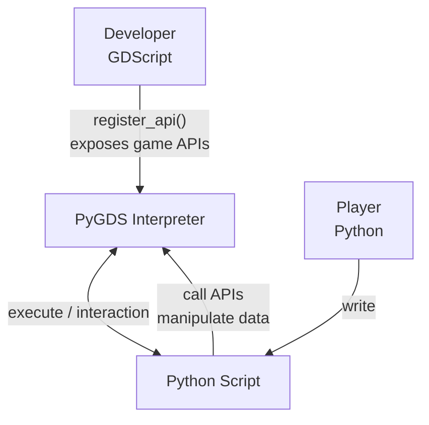

# PyGDS — Python Runtime Simulator for Godot

A Python 3.x subset interpreter implemented in GDScript, enabling Python-like script execution on all platforms that support GDScript

> 如果您需要阅读中文文档，请访问 [README.md](./README.md)

---

## Design Philosophy

PyGDS is an embedded scripting engine, **NOT a GDScript replacement.**

Its purpose is: **enabling "players" to interact with game data and behavior using Python syntax**, while "developers" expose game system APIs to scripts via `register_api()`.



**What PyGDS does:**

- Provide Python-syntax scripting for games (variables, functions, classes, control flow, exceptions)
- Allow non-developers to manipulate game data and configure game logic with familiar Python syntax
- Serve as a scripting engine for mod systems, enabling players to write custom behaviors

**What PyGDS does NOT do:**

- Replace GDScript for core game logic — core logic remains in GDScript
- Provide a full Python standard library — only basic types (`str`/`list`/`dict`) and a few built-in functions
- Support `import`/module system — scripts are standalone single files
- Support `async`/`await`/`yield` — The game script interaction is synchronous, but it provides a suspended system

---

## Quick Start

PyGDS is a GDScript class that inherits from `Node`.

Instantiate it, pass code via `write_dsl_script()`, then call `run()` to execute.

```gdscript
extends Node

func _ready() -> void:
    var dsl = PyGDS.new()

    # Terminal output won't print to Godot console in non-debug mode
    dsl.set_debug_mode(true)

    dsl.write_dsl_script("""
print("Hello, PyGDS!")
info("This is an INFO log")
warn("This is a WARN log")
""")
    dsl.run()

    # Get terminal output and logs
    print(dsl.print_output)
    print(dsl.console_output)

    # Adjust log level
    dsl.set_log_level(PyGDS.ConsoleReport.Level.WARN)
    print(dsl.console_output)  # Only WARN level and above
```

---

## Installation & Integration

PyGDS offers two ways to integrate:

### Option 1: Single-File Integration (recommended)

All of PyGDS's core code lives in a single file, [pygds.gd](./pygds.gd), with no external dependencies.

1. Copy `pygds.gd` into your Godot project (any location, project root recommended)
2. The `class_name PyGDS` at the top of the file is auto-registered as a global class; no extra setup needed
3. Use it via `PyGDS.new()` or `load("res://pygds.gd").new()`

```gdscript
var dsl = PyGDS.new()
dsl.write_dsl_script("print('Hello!')")
dsl.run()
```

### Option 2: As an Editor Plugin (optional)

The bundled [addons/pygds](./addons/pygds/) provides an editor plugin that adds a **Project > Tools > Run PyGDS Script...** action to select and run `.py` scripts from your project, printing output to the editor console.

1. Copy the `addons/pygds/` directory into your project (it depends on `pygds.gd` in the project root)
2. In the Godot editor, open **Project Settings → Plugins** and enable **PyGDS**

> The plugin's core is still the single-file `pygds.gd`; the editor plugin is just a development convenience.

---

## Python Compatibility Matrix

| Feature | Support | Notes |
| :--- | :--- | :--- |
| Variable Assignment | ✅ Full | Regular, multi-assignment, unpacking |
| Integer (`int`) | ✅ Full | All operators: +, -, *, /, %, **, etc. |
| Float (`float`) | ✅ Full | Same operator support as `int` |
| String (`str`) | ✅ Full | Common methods: `upper`/`lower`/`split`/`join`, etc. |
| List (`list`) | ✅ Full | All methods: `append`/`extend`/`pop`/`sort`, etc. |
| Tuple (`tuple`) | ✅ Full | Immutable sequence |
| Dictionary (`dict`) | ✅ Full | Methods: `items`/`keys`/`values`/`get`/`pop`, etc. |
| Boolean (`bool`) | ✅ Full | `True`/`False`/`None` singletons |
| `if`/`elif`/`else` | ✅ Full | Including ternary operator (`a if cond else b`) |
| `while` loops | ✅ Full | Including `break`/`continue` |
| `for` loops | ✅ Full | Iteration over list/tuple/string/dict |
| Function Definitions | ✅ Full | Regular functions, default args, `*args`, `**kwargs` |
| Class Definitions | ✅ Full | Inheritance, method overrides, instance attributes |
| Static Methods | ✅ Full | `@staticmethod` decorator |
| Class Methods | ✅ Full | `@classmethod` decorator |
| Exception Handling | ✅ Full | `try`/`except`/`else`/`finally`/`raise` with custom exception classes |
| `is` / `is not` | ✅ Full | Identity operators |
| `id()` | ✅ Full | Object identifiers |
| `global`/`nonlocal` | ✅ Full | Variable scope declarations |
| List Comprehensions | ✅ Full | `[x for x in iterable [if cond]]` |
| Generator Expressions | ✅ Full | `(x for x in iterable [if cond])`, lazy generator, supports `next()` and bare `sum(x for x in ...)` |
| Dict Comprehensions | ✅ Full | `{k: v for k, v in ... [if cond]}` |
| Set Comprehensions | ✅ Full | `{x*x for x in iterable [if cond]}` |
| Multiple `for` clauses | ✅ Full | `[x*y for x in a for y in b]`, each `for` may carry several `if`; list/dict/set comprehensions and generator expressions all support it, loop variables may be `k, v` tuple targets |
| Literal `*` unpacking | ✅ Full | `[*a, *b]` / `[1, *mid, 2]` / `(*a,)` / `{*a, 1}` (Python 3.5+) |
| Assignment expressions (`:=`) | ✅ Full | `if (n := len(a)) > 5:`, `while chunk := read():`, binds to the enclosing scope inside comprehensions (Python 3.8+); matching CPython, both "rebinding a comprehension iteration variable" and "appearing in a comprehension iterable expression" are rejected |
| `slice` | ✅ Full | `slice(start, stop[, step])` object, reusable indexing `lst[slice(...)]` |
| Augmented Assignment | ✅ Full | `+=`, `-=`, `*=`, `/=`, etc. |
| Subscript Access | ✅ Full | `obj[key]` with `getitem`/`setitem`; slice assignment/deletion `a[1:3] = [9]` / `del a[1:3]` |
| Attribute Access | ✅ Full | `obj.attr` with `getattr`/`setattr` |
| Method Type System | ✅ Full | 7 types strictly matching CPython |
| Descriptor Protocol | ✅ Full | `__get__` implementing class-level/instance-level binding |
| Magic Methods | ✅ Full | `__add__`/`__str__`/`__init__`, etc., registered at class level |
| Operators | ✅ Full | Binary/unary/comparison/augmented all supported |
| f-string | ✅ Full | `f"value: {x:.2f}"`, with format specifiers, conversion flags, `=` debug specifier and nested format widths |
| lambda | ✅ Full | Anonymous functions with default arguments and closures |
| `super()` | ✅ Full | Call parent methods/constructors under single inheritance |
| `getattr`/`setattr`/`delattr`/`hasattr` | ✅ Full | Built-in reflection functions |
| `map()`/`filter()` | ✅ Full | Built-in functional tools |
| Runtime error line numbers | ✅ Full | Uncaught exceptions include `(line N)` |
| Number literals | ✅ Full | `0x1F` / `0o17` / `0b101` / `1_000_000` / `1e5`; `int("ff", 16)` parses in a base |
| Call-site `*`/`**` unpacking | ✅ Full | `f(*args)` / `f(**kwargs)` |
| Dict merge | ✅ Full | `d1 \| d2` / `d1 \|= d2` / `{**a, **b}` (Python 3.9+) |
| `str` `%` formatting | ✅ Full | `"%s: %d" % (x, y)` (printf style) |
| `str.format` | ✅ Full | `"{:.2f} {:>8}".format(x, s)`, with positional/keyword arguments and format specifiers |
| Built-in modules | ✅ Full | `import math` / `from math import sqrt` (math/random/statistics/functools/itertools/collections/string/operator/time; math has comb/perm/prod/lcm/cbrt/remainder, random has choices/gauss, statistics has quantiles, functools has cmp_to_key, itertools has repeat/cycle/count/zip_longest/takewhile/dropwhile/accumulate/pairwise/groupby/starmap, operator exposes operator functions plus itemgetter/attrgetter) |
| `set` | ✅ Full | Literal `{1, 2}`, constructor, set operations and methods |
| `frozenset` | ✅ Full | Immutable set, hashable, supports set operations and comparisons |
| `bytes` type | ✅ Full | `b"xy"` literals and the `bytes()` constructor (zero-filled integer / iterable / string encoding / copy); method family `decode` / `hex` / `upper` / `lower` / `title` / `strip` family / `split` / `replace` / `find` / `index` / `count` / `startswith` / `endswith` / `join` / `center` / `ljust` / `rjust`; indexing/iteration yield integers, plus slicing, repetition and `in`, strictly distinct from `str` |
| `range` type | ✅ Full | A distinct lazy `range` object supporting `len` / indexing / slicing / containment / iteration without materialising large ranges |
| Multiple assignment targets | ✅ Full | `a[0], a[2] = a[2], a[0]`, `o.x, o.y = 1, 2`, including chained suffixes like `self.data[k] = v` |
| `dict` views | ✅ Full | `keys()` / `values()` are iterable and support `len` and `in` |
| Multiple Inheritance | ❌ Not Supported | Single inheritance only |
| `async`/`await` | ❌ Not Supported | Recognised as reserved keywords only: `await` placement and misuse of `async for` / `async with` / `async` raise the corresponding CPython `SyntaxError` |
| Generators/`yield` | ✅ Full | Generator functions (`def` containing `yield`); calling returns a lazy `generator` object without executing the body. Supports statement-level and expression-level `yield`, `yield from` delegation, `send` injection, `throw` / `close` (`GeneratorExit`), `StopIteration.value` (generator `return` value), generator methods, lambda generators (Python 3.12+), alternating and nested generators (including `time.sleep()` inside nested generators), full `send` / `throw` delegation through `yield from` (PEP 380, sub-generator catches first), and closures persisting across `yield` |
| Decorators | ⚠️ Partial | `@staticmethod` / `@classmethod` / `@property` (with getter/setter/deleter) |
| `with` Statement | ❌ Not Supported | — |
| User-file `import` | ❌ Not Supported | Built-in modules only (math/random/statistics/functools/itertools/collections/string/operator/time) |

> **⚠️ Breaking Change (v0.3.0)**: Generator expressions `(x for x in iterable)` have changed from "eagerly evaluated to a list" to "lazy generator object".
> Code that directly subscripts/`len()`s or calls list methods on a generator expression result will fail — convert with `list(g)` / `tuple(g)` first
> generators are one-shot iterators (re-iterating does not restart).
>
> **⚠️ Breaking Change (v0.4.0)**: `yield` is now a reserved keyword and can no longer be used as an identifier (variable/function name, etc.). Code that used `yield` as a name must rename it.
>
> **⚠️ Breaking Change (v0.5.0-alpha.1)**: `sleep()` has moved into the `time` module — use `import time` then `time.sleep(n)`. A bare `sleep()` no longer exists (matching CPython, which has no built-in bare `sleep` either).
>
> **⚠️ Breaking Change (v0.5.0-alpha.4)**: `async` / `await` are now reserved keywords and can no longer be used as identifiers (variable/function names, etc.). `return` / `break` / `continue` outside a function body or loop body now raise `SyntaxError` (previously ignored silently). Code using `async` / `await` as names must rename them.
>
> Known behavioural differences and missing features (`yield` resumption re-evaluating prefixes, `send` / `throw` not forwarded, multiple assignment targets, user-class iteration protocol, and so on) have moved to the **Known Issues & Limitations** section below

---

## Known Issues & Limitations

The following lists behaviours that currently diverge from CPython or are not implemented. **P0 = silent wrong values** (most dangerous, fix first), **P1 = a clear error or a missing feature**, **P2 = a edge difference**.

### P0 — Silent Wrong Values

The 10 P0 defects uncovered while finalising v0.5.0-alpha.5 (P0-3 to P0-12: nested-container equality, floor division and modulo for negative operands, escape-sequence decoding, sequence sorting, `min`/`max` `key`, slice `del`, `repr(None)`, `chr()`/`%c` range checks, `format` grouping, and the `iter(list)` live view) were **all fixed in v0.5.0-alpha.6**; see the corresponding section of `CHANGELOG`

### P1 — Clear Errors or Missing Features

Items P1-1 to P1-6, P1-11, P1-14 and P1-16 to P1-18 were fixed in v0.5.0-alpha.3 to v0.5.0-alpha.5; P1-19 to P1-29 found by the same audit (implicit line continuation inside brackets, one-line compound statements, `try`/`else`, slice assignment, genexpr tuple elements, user-class subscript and conversion protocols, sequence ordering comparisons, `None` as a dict key, the `iter()` type name, and `hasattr`) were **all fixed in v0.5.0-alpha.6**; see the corresponding section of `CHANGELOG`

| ID | Issue | Details |
| :--- | :--- | :--- |
| P1-7 | `with` statement unsupported | Not implemented by design for now |
| P1-8 | User-file `import` unsupported | Not implemented by design for now; only built-in modules (math / random / statistics / functools / itertools / collections / string / operator / time) |
| P1-9 | `async` / `await` unsupported | Not implemented by design for now; async scenarios use the suspend system (`time.sleep` / `request_suspend_waiting`). As reserved words, misuse of `async` / `await` now raises `SyntaxError` matching CPython |
| P1-10 | `match` / `case` structural pattern matching unsupported | Deferred to v0.6.0 |
| P1-13 | `yield` resumption may re-evaluate prefix subexpressions | Common forms fixed in v0.5.0-alpha.3 (memoised by node + occurrence); the iteration-cap issue of the same family was fixed in v0.5.0-alpha.4, and repeated yields when a plain `yield` and a `yield from` alternate in one statement were fixed in v0.5.0-alpha.5. Remaining: several structurally equal calls in one statement can still be mistaken for each other (values and wait counts are correct; only the side-effect count is too high), which needs expression-level continuations to resolve fully |

### P2 — Edge Differences

| ID | Issue | Details |
| :--- | :--- | :--- |
| P2-1 | `random` sequences differ from CPython | PyGDS uses its own xorshift32 PRNG, so drawn values differ (argument type rules are aligned, and `seed()` makes sequences reproducible within PyGDS) |
| P2-2 | Some syntax-error messages differ | Messages for misuse of `async` / `await` / `return` / `break` / `continue` and for trailing redundant tokens are aligned; the unclosed-bracket message was aligned in **v0.5.0-alpha.6** (`'(' was never closed`). Wording and line-number formatting of other parse-time errors may still differ (e.g. a missing colon, an unterminated string) |
| P2-4 | `hash` values differ from CPython | PyGDS uses stable hash values for `hash(None)` etc., while CPython hashes are process-randomised; only the numeric values differ, and the equality/hash-consistency semantics match |

### Platform Limitations

| Limitation | Details |
| :--- | :--- |
| str literals cannot contain NUL | Godot's String cannot store U+0000 (it would be replaced with U+FFFD), so `'\x00'` / `'\0'` str escapes raise `SyntaxError` at decode time; bytes are unaffected (`b'\x00'` works) |
| `\N{...}` supports only the built-in name table | Godot has no Unicode name database; PyGDS ships about 200 names covering printable ASCII full names and common symbols (e.g. `\N{BULLET}',`\N{LATIN CAPITAL LETTER A}'). Names outside the table raise `SyntaxError: unknown Unicode character name` matching CPython's behaviour for unknown names |

---

## Architecture Overview

PyGDS implements a complete interpreter pipeline:

```txt
Source Code (Python-like) → Lexer → Parser → AST → Interpreter → Execution
```

***Core Components***

| Component | Responsibility |
| :--- | :--- |
| **Lexer** | Scans source strings into a token stream, identifying keywords, identifiers, literals, operators, etc. |
| **Parser** | Recursive descent parser that builds an abstract syntax tree (AST) from tokens |
| **Interpreter** | Traverses AST nodes and executes them one by one, managing scope and runtime state |
| **DSLObject System** | Multiple runtime object types, all inheriting from DSLObject, with unified type lookup via the `klass` field (matching CPython's `PyObject.ob_type`). The `fields` dictionary (Python's `__dict__`, `null` = built-in types without `__dict__`) stores instance attributes, implementing Python's "everything is an object" semantics |
| **DSLClass** | Class system supporting inheritance, method overrides, `@staticmethod`, `@classmethod`, `@property`. DSLObject directly serves as instances (no separate DSLInstance layer needed), with a three-level naming convention: `_dsl_*` (internal fast path), `magic_*` (DSL magic method protocol), `builtin_*` (DSL built-in methods) |
| **PyGDS** | Main controller, integrating Lexer/Parser/Interpreter, providing the public API |

---

## API Registration

PyGDS supports registering GDScript functions as callable global functions in PyGDS scripts via `register_api()`.

```gdscript
extends Node

func _ready() -> void:
    var dsl = PyGDS.new()
    dsl.set_debug_mode(true)

    dsl.register_api({
        "my_func": func(args, kwargs):
            return PyGDS.DSLString.new("hello from GDScript!")
    })

    dsl.write_dsl_script("""
result = my_func()
print(result)
""")
    dsl.run()
```

`register_api()` accepts a `Dictionary` with function names (strings) as keys and `Callable` values. Registered functions can be called directly by name in PyGDS scripts.

---

## Suspend System

PyGDS provides a suspend mechanism that allows DSL scripts to pause during execution and resume when external conditions are met. This is a unique PyGDS feature not found in standard Python, suitable for game scenarios like delays, waiting for player input, and playing animations.

Two types of suspension:

| Type | Call Method | Use Case | Resume |
| :--- | :--- | :--- | :--- |
| SLEEPING | DSL calls `time.sleep(n)`, API functions call `request_suspend_sleeping()` | Known wait time | Timer fires, automatically calls `run()` |
| WAITING | API functions call `request_suspend_waiting()` | Unknown wait time | External sets `state = RUNNING` then calls `run()` |

The `run()` method returns a `State` enum value (`FINISHED` / `SUSPENDED_SLEEPING` / `SUSPENDED_WAITING` / `ERROR`), allowing external code to drive the execution flow.

```gdscript
var dsl = PyGDS.new()

# SLEEPING suspend auto-resumes via SceneTree.create_timer
# Set _sleeping_resume_callback for additional logic on resume
# (called before run() resumes execution; Timer always calls run(), callback is for extra logic only)

# WAITING suspend is triggered by API functions calling request_suspend_waiting()
dsl.register_api_pair("wait_for_confirm", func(_args, _kwargs):
    dsl.request_suspend_waiting()
)

dsl.write_dsl_script("""
import time
print("Start")
time.sleep(1.0)
print("Continues after 1 second")
wait_for_confirm()
print("Continues after manual resume")
""")

var state = dsl.run()
# state == PyGDS.State.SUSPENDED_SLEEPING, waiting for Timer
# When Timer fires, run() is called automatically, encounters wait_for_confirm() → SUSPENDED_WAITING
# External sets dsl.state = PyGDS.State.RUNNING then calls dsl.run() to continue
```

---

## Behavioral Tests

The [py_package](./py_package/) package contains a [tests](./py_package/tests/) folder and a [test.py](./py_package/test.py) file. Running it will execute all Python files in the [tests](./py_package/tests/) folder, capture console output, and save results based on the `OUTPUT_FILE` variable (defaults to `./expected.json`).

The JSON structure is `{"test_name": {"source": "source code", "expected": "console output or compilation error"}}`.

You can run the GDScript test file using:

```cmd
godot --headless --path /your/project/path --script /pygds/path/test.gd
```

to verify that PyGDS behavior matches Python.

### Adding Tests and Regenerating expected.json

After adding a new `*.py` test file to [tests](./py_package/tests/), record the real Python output into `expected.json`:

```cmd
cd py_package
python test.py
```

> **Note**: `expected.json` is a **curated** baseline. `test.py` rewrites it entirely, and a few cases (e.g., the object memory address in `edge_str_repr`) need manual normalization to the `<OnlyStr object>` form. Recommended workflow: after running `test.py`, **merge only the `expected` values of newly added cases** into the existing file, keep the already-curated entries, then run `test.gd` to verify.

---

## Demo Tests

The `demo/` directory contains a complete demo scene for the suspend system. Open the scene file in the Godot editor to run it, visually demonstrating three suspend modes (passive, active, and active + on_resume callback) in a turn-based combat simulation.

---

## FAQ

### How do I load a script from a file?

It is recommended to write DSL code in standalone `.py` files (avoiding GDScript string escaping and Tab indentation issues), then read and execute them at runtime:

```gdscript
func run_script_file(path: String) -> void:
    var file = FileAccess.open(path, FileAccess.READ)
    var source = file.get_as_text()
    file.close()
    dsl.write_dsl_script(source)
    dsl.run()
```

### How do scripts interact with scenes/nodes?

Expose nodes or game logic to scripts via `register_api()`. API functions are defined on the GDScript side and can capture outer variables (such as node references):

```gdscript
dsl.register_api_pair("move_player", func(args, _kwargs):
    var dx = args[0]._dsl_str()
    player.position.x += float(dx)   # player is a node reference captured outside the script
    return PyGDS.DSLNone.new(),
)
```

The script can then call `move_player(10)` to manipulate the scene node.

### Why don't I see `print()` output in the Godot console?

In non-debug mode, output is not printed to the console in real time; it accumulates in `dsl.print_output`. Call `dsl.set_debug_mode(true)` to make `print()` output directly to the console.

### Can scripts read player input or network data?

Yes. Expose GDScript-side capabilities to scripts via `register_api()`; asynchronous scenarios that need to wait are implemented with the suspend system (`time.sleep` / `request_suspend_waiting`) rather than Python's `async/await`.

---

## Detailed Documentation

| Document | Description |
| :--- | :--- |
| [architecture.md](docs/en/architecture.md) | Architecture details and execution flow |
| [method_type_system.md](docs/en/method_type_system.md) | Method type system (matching CPython) |
| [class_system.md](docs/en/class_system.md) | Class and instance system |
| [builtin_types.md](docs/en/builtin_types.md) | Built-in type details |
| [exception_system.md](docs/en/exception_system.md) | Exception system |
| [usage.md](docs/en/usage.md) | Usage guide and API registration |
