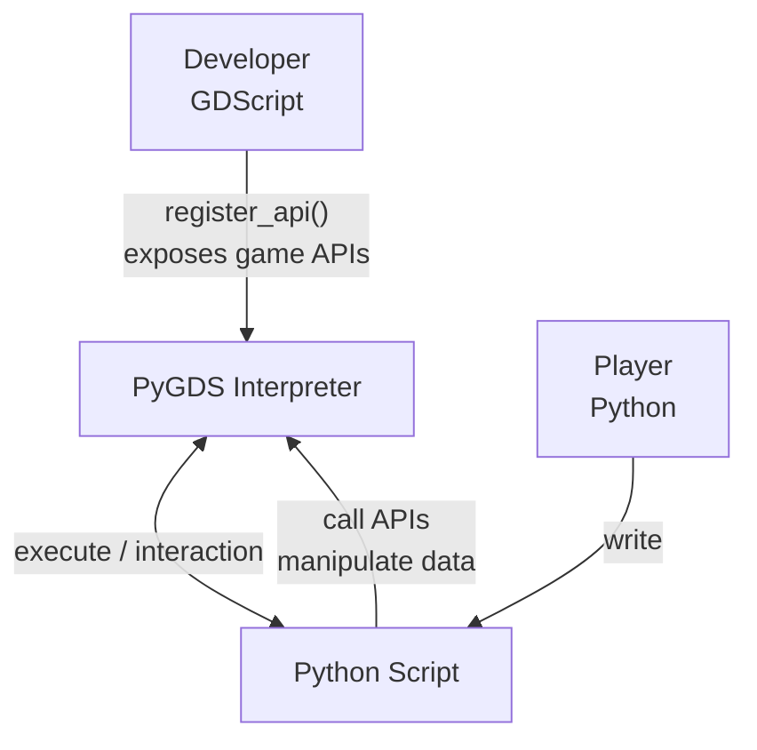

# PyGDS — Python Runtime Simulator for Godot

A Python 3.x subset interpreter implemented in GDScript, enabling Python-like script execution on all platforms that support GDScript

> 如果您需要阅读中文文档，请访问 [README.md](./README.md)

---

## Design Philosophy

PyGDS is an embedded scripting engine, **NOT a GDScript replacement.**

Its purpose is: **enabling "players" to interact with game data and behavior using Python syntax**, while "developers" expose game system APIs to scripts via `register_api()`.



**What PyGDS does:**

- Provide Python-syntax scripting for games (variables, functions, classes, control flow, exceptions)
- Allow non-developers to manipulate game data and configure game logic with familiar Python syntax
- Serve as a scripting engine for mod systems, enabling players to write custom behaviors

**What PyGDS does NOT do:**

- Replace GDScript for core game logic — core logic remains in GDScript
- Provide a full Python standard library — only basic types (`str`/`list`/`dict`) and a few built-in functions
- Support `import`/module system — scripts are standalone single files
- Support `async`/`await`/`yield` — The game script interaction is synchronous, but it provides a suspended system

---

## Quick Start

PyGDS is a GDScript class that inherits from `Node`.

Instantiate it, pass code via `write_dsl_script()`, then call `run()` to execute.

```gdscript
extends Node

func _ready() -> void:
    var dsl = PyGDS.new()

    # Terminal output won't print to Godot console in non-debug mode
    dsl.set_debug_mode(true)

    dsl.write_dsl_script("""
print("Hello, PyGDS!")
info("This is an INFO log")
warn("This is a WARN log")
""")
    dsl.run()

    # Get terminal output and logs
    print(dsl.print_output)
    print(dsl.console_output)

    # Adjust log level
    dsl.set_log_level(PyGDS.ConsoleReport.Level.WARN)
    print(dsl.console_output)  # Only WARN level and above
```

---

## Python Compatibility Matrix

| Feature | Support | Notes |
| :--- | :--- | :--- |
| Variable Assignment | ✅ Full | Regular, multi-assignment, unpacking |
| Integer (`int`) | ✅ Full | All operators: +, -, *, /, %, **, etc. |
| Float (`float`) | ✅ Full | Same operator support as `int` |
| String (`str`) | ✅ Full | Common methods: `upper`/`lower`/`split`/`join`, etc. |
| List (`list`) | ✅ Full | All methods: `append`/`extend`/`pop`/`sort`, etc. |
| Tuple (`tuple`) | ✅ Full | Immutable sequence |
| Dictionary (`dict`) | ✅ Full | Methods: `items`/`keys`/`values`/`get`/`pop`, etc. |
| Boolean (`bool`) | ✅ Full | `True`/`False`/`None` singletons |
| `if`/`elif`/`else` | ✅ Full | Including ternary operator (`a if cond else b`) |
| `while` loops | ✅ Full | Including `break`/`continue` |
| `for` loops | ✅ Full | Iteration over list/tuple/string/dict |
| Function Definitions | ✅ Full | Regular functions, default args, `*args`, `**kwargs` |
| Class Definitions | ✅ Full | Inheritance, method overrides, instance attributes |
| Static Methods | ✅ Full | `@staticmethod` decorator |
| Class Methods | ✅ Full | `@classmethod` decorator |
| Exception Handling | ✅ Full | `try`/`except`/`finally`/`raise`, custom exception classes |
| `is` / `is not` | ✅ Full | Identity operators |
| `id()` | ✅ Full | Object identifiers |
| `global`/`nonlocal` | ✅ Full | Variable scope declarations |
| List Comprehensions | ✅ Full | `[x for x in iterable [if cond]]` |
| Generator Expressions | ⚠️ Partial | `(x for x in iterable [if cond])` |
| Dict Comprehensions | ✅ Full | `{k: v for k, v in ... [if cond]}` |
| Augmented Assignment | ✅ Full | `+=`, `-=`, `*=`, `/=`, etc. |
| Subscript Access | ✅ Full | `obj[key]` with `getitem`/`setitem` |
| Attribute Access | ✅ Full | `obj.attr` with `getattr`/`setattr` |
| Method Type System | ✅ Full | 7 types strictly matching CPython |
| Descriptor Protocol | ✅ Full | `__get__` implementing class-level/instance-level binding |
| Magic Methods | ✅ Full | `__add__`/`__str__`/`__init__`, etc., registered at class level |
| Operators | ✅ Full | Binary/unary/comparison/augmented all supported |
| Multiple Inheritance | ❌ Not Supported | Single inheritance only |
| `async`/`await` | ❌ Not Supported | — |
| Generators/`yield` | ❌ Not Supported | — |
| Decorators | ⚠️ Partial | `@staticmethod` / `@classmethod` / `@property` (with getter/setter/deleter) |
| `with` Statement | ❌ Not Supported | — |
| Module/`import` | ❌ Not Supported | — |
| Set (`set`) | ❌ Not Supported | — |

---

## Architecture Overview

PyGDS implements a complete interpreter pipeline:

```txt
Source Code (Python-like) → Lexer → Parser → AST → Interpreter → Execution
```

***Core Components***

| Component | Responsibility |
| :--- | :--- |
| **Lexer** | Scans source strings into a token stream, identifying keywords, identifiers, literals, operators, etc. |
| **Parser** | Recursive descent parser that builds an abstract syntax tree (AST) from tokens |
| **Interpreter** | Traverses AST nodes and executes them one by one, managing scope and runtime state |
| **DSLObject System** | Multiple runtime object types, all inheriting from DSLObject, with unified type lookup via the `klass` field (matching CPython's `PyObject.ob_type`). The `fields` dictionary (Python's `__dict__`, `null` = built-in types without `__dict__`) stores instance attributes, implementing Python's "everything is an object" semantics |
| **DSLClass** | Class system supporting inheritance, method overrides, `@staticmethod`, `@classmethod`, `@property`. DSLObject directly serves as instances (no separate DSLInstance layer needed), with a three-level naming convention: `_dsl_*` (internal fast path), `magic_*` (DSL magic method protocol), `builtin_*` (DSL built-in methods) |
| **PyGDS** | Main controller, integrating Lexer/Parser/Interpreter, providing the public API |

---

## API Registration

PyGDS supports registering GDScript functions as callable global functions in PyGDS scripts via `register_api()`.

```gdscript
extends Node

func _ready() -> void:
    var dsl = PyGDS.new()
    dsl.set_debug_mode(true)

    dsl.register_api({
        "my_func": func(args, kwargs):
            return PyGDS.DSLString.new("hello from GDScript!")
    })

    dsl.write_dsl_script("""
result = my_func()
print(result)
""")
    dsl.run()
```

`register_api()` accepts a `Dictionary` with function names (strings) as keys and `Callable` values. Registered functions can be called directly by name in PyGDS scripts.

---

## Suspend System

PyGDS provides a suspend mechanism that allows DSL scripts to pause during execution and resume when external conditions are met. This is a unique PyGDS feature not found in standard Python, suitable for game scenarios like delays, waiting for player input, and playing animations.

Two types of suspension:

| Type | Call Method | Use Case | Resume |
| :--- | :--- | :--- | :--- |
| SLEEPING | DSL calls `sleep(n)`, API functions call `request_suspend_sleeping()` | Known wait time | Timer fires, automatically calls `run()` |
| WAITING | API functions call `request_suspend_waiting()` | Unknown wait time | External sets `state = RUNNING` then calls `run()` |

The `run()` method returns a `State` enum value (`FINISHED` / `SUSPENDED_SLEEPING` / `SUSPENDED_WAITING` / `ERROR`), allowing external code to drive the execution flow.

```gdscript
var dsl = PyGDS.new()

# SLEEPING suspend auto-resumes via SceneTree.create_timer
# Set _sleeping_resume_callback for additional logic on resume
# (called before run() resumes execution; Timer always calls run(), callback is for extra logic only)

# WAITING suspend is triggered by API functions calling request_suspend_waiting()
dsl.register_api_pair("wait_for_confirm", func(_args, _kwargs):
    dsl.request_suspend_waiting()
)

dsl.write_dsl_script("""
print("Start")
sleep(1.0)
print("Continues after 1 second")
wait_for_confirm()
print("Continues after manual resume")
""")

var state = dsl.run()
# state == PyGDS.State.SUSPENDED_SLEEPING, waiting for Timer
# When Timer fires, run() is called automatically, encounters wait_for_confirm() → SUSPENDED_WAITING
# External sets dsl.state = PyGDS.State.RUNNING then calls dsl.run() to continue
```

---

## Behavioral Tests

The [py_package](./py_package/) package contains a [tests](./py_package/tests/) folder and a [test.py](./py_package/test.py) file. Running it will execute all Python files in the [tests](./py_package/tests/) folder, capture console output, and save results based on the `OUTPUT_FILE` variable (defaults to `./expected.json`).

The JSON structure is `{"test_name": {"source": "source code", "expected": "console output or compilation error"}}`.

You can run the GDScript test file using:

```cmd
godot --headless --path /your/project/path --script /pygds/path/test.gd
```

to verify that PyGDS behavior matches Python.

---

## Demo Tests

The `demo/` directory contains a complete demo scene for the suspend system. Open the scene file in the Godot editor to run it, visually demonstrating three suspend modes (passive, active, and active + on_resume callback) in a turn-based combat simulation.

---

## Detailed Documentation

| Document | Description |
| :--- | :--- |
| [architecture.md](docs/en/architecture.md) | Architecture details and execution flow |
| [method_type_system.md](docs/en/method_type_system.md) | Method type system (matching CPython) |
| [class_system.md](docs/en/class_system.md) | Class and instance system |
| [builtin_types.md](docs/en/builtin_types.md) | Built-in type details |
| [exception_system.md](docs/en/exception_system.md) | Exception system |
| [usage.md](docs/en/usage.md) | Usage guide and API registration |
