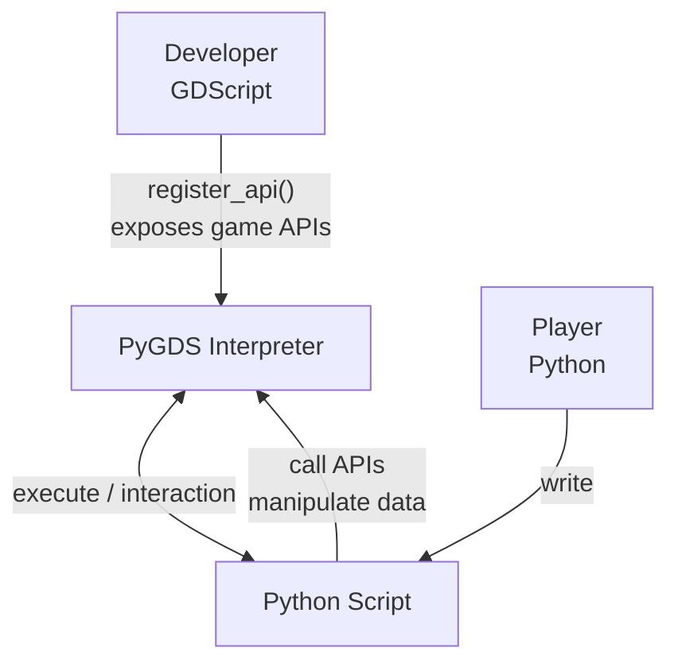

# PyGDS — Python Runtime Simulator for Godot

A Python 3.x subset interpreter implemented in GDScript, enabling Python-like script execution on all platforms that support GDScript

> 如果您需要阅读中文文档，请访问 [README.md](./README.md)

---

## Design Philosophy

PyGDS is an embedded scripting engine, **NOT a GDScript replacement.**

Its purpose is: **enabling "players" to interact with game data and behavior using Python syntax**, while "developers" expose game system APIs to scripts via `register_api()`.


```mermaid
flowchart TD
    A[Developer<br>GDScript] -->|"register_api()<br>exposes game APIs"| B[PyGDS Interpreter]
    B <-->|execute / interaction| C[Python Script]
    C -->|call APIs<br>manipulate data| B
    D[Player<br>Python] -->|write| C
```

**What PyGDS does:**

- Provide Python-syntax scripting for games (variables, functions, classes, control flow, exceptions, generators, comprehensions, pattern matching)
- Allow non-developers to manipulate game data and configure game logic with familiar Python syntax
- Serve as a scripting engine for mod systems: multi-file mods inside a drive sandbox, user-module `import`, host API registration

**What PyGDS does NOT do:**

- Replace GDScript for core game logic — core logic remains in GDScript
- Provide the complete CPython standard library — a number of common modules are built in, the rest of the standard library is not implemented
- Implement CPython packages / namespace packages and C-extension module loading — user modules are single files `<name>.py` resolved directory by directory along `sys.path`
- Provide an event loop or concurrency runtime (`asyncio` etc.) — `async` / `await` are emulated with coroutine objects (driven synchronously); in-game waiting is handled by the suspend system

---

## Quick Start

PyGDS is a GDScript class that inherits from `Node`.

Instantiate it, pass code via `write_dsl_script()`, then call `run()` to execute.

```gdscript
extends Node

func _ready() -> void:
    var dsl = PyGDS.new()

    # Terminal output won't print to Godot console in non-debug mode
    dsl.set_debug_mode(true)

    dsl.write_dsl_script("""
print("Hello, PyGDS!")
info("This is an INFO log")
warn("This is a WARN log")
""")
    dsl.run()

    # Get terminal output and logs
    print(dsl.print_output)
    print(dsl.console_output)

    # Adjust log level
    dsl.set_log_level(PyGDS.ConsoleReport.Level.WARN)
    print(dsl.console_output)  # Only WARN level and above
```

---

## Installation & Integration

PyGDS offers the following ways to integrate:

### Single-file integration

All of PyGDS's core code lives in a single file, [pygds.gd](./pygds.gd), with no external dependencies.

1. Copy `pygds.gd` into your Godot project (any location, project root recommended)
2. The `class_name PyGDS` at the top of the file is auto-registered as a global class; no extra setup needed
3. Use it via `PyGDS.new()` or `load("res://pygds.gd").new()`

```gdscript
var dsl = PyGDS.new()
dsl.write_dsl_script("print('Hello!')")
dsl.run()
```

### Drive-letter virtual sandbox (optional)

To let scripts read and write files or load in-drive modules, pass a drive letter and an access switch at instantiation; the script-visible space converges into `user://<base_path>/<drive>/` with zero contact with the real file system. See [usage.md#Drive-Letter Virtual Sandbox](docs/en/usage.md#drive-letter-virtual-sandbox) for the implementation details:

```gdscript
var dsl = PyGDS.new("MOD1", true)
dsl.write_dsl_script("print(open('data.txt').read())")
dsl.run()

dsl.load_dsl_script("main.py")   # read the main file from the drive (multi-file mod scenarios)
dsl.run()
```

---

## Python Compatibility Matrix

This table is a support overview; for the detailed syntax and semantics of each feature see [usage.md#DSL Syntax Reference](docs/en/usage.md#dsl-syntax-reference).

Support-level markers:

- ✅ Full = behavior matches CPython
- 🟡 Subset = a pragmatic subset with clear limitations
- 🔵 Accepted = syntax accepted, semantics ignored or emulated
- ❌ Missing = parse-time or runtime error

| Feature | Support | Notes |
| :--- | :--- | :--- |
| **Basic syntax & operators** | | |
| Operators | ✅ Full | Binary/unary/comparison/augmented all supported |
| Variable assignment | ✅ Full | Regular/multiple/unpacking/augmented assignment and assignment expressions (`:=`) |
| Multiple assignment targets | ✅ Full | Subscript/attribute/key targets and chained suffixes |
| Subscript access | ✅ Full | Subscript read/write and slice assignment/deletion |
| Attribute access | ✅ Full | `obj.attr` read/write |
| `is` / `is not` | ✅ Full | Identity operators |
| `id()` | ✅ Full | Object identifiers |
| `global` / `nonlocal` | ✅ Full | Variable scope declarations |
| **Built-in scalar types** | | |
| Integers (`int`) | ✅ Full | All operators and number literals (arbitrary precision) |
| Floats (`float`) | ✅ Full | Same operator support as `int` |
| Complex (`complex`) | ✅ Full | `1j` literals, construction, arithmetic, comparison and dict keys |
| Boolean (`bool`) | ✅ Full | `True`/`False`/`None` singletons |
| Strings (`str`) | ✅ Full | Common methods plus `%` / `format` / `f-string` formatting |
| Bytes (`bytes`) | ✅ Full | Literals/constructor and the full method family |
| Byte Arrays (`bytearray`) | ✅ Full | Mutable byte sequence, construction and methods |
| Memory Views (`memoryview`) | 🟡 Subset | One-dimensional B-format views (read-only / write-through) |
| **Container types** | | |
| Lists (`list`) | ✅ Full | Common methods: `append`/`extend`/`pop`/`sort`, etc. |
| Tuples (`tuple`) | ✅ Full | Immutable sequence |
| Ranges (`range`) | ✅ Full | A distinct lazy sequence (`len`/indexing/slicing/iteration) |
| Dictionaries (`dict`) | ✅ Full | Common methods and `\|` merge (Python 3.9+) |
| Dictionary Views (`dict_keys` / `dict_values` / `dict_items`) | ✅ Full | Live views (iteration, `len` and membership) |
| Sets (`set`) | ✅ Full | Literal, constructor, set operations and methods |
| Frozen Sets (`frozenset`) | ✅ Full | Immutable set, hashable |
| Slices (`slice`) | ✅ Full | Reusable slice objects and indexing |
| **Control flow** | | |
| `if`/`elif`/`else` | ✅ Full | Including the ternary operator |
| `while` loops | ✅ Full | Including `break`/`continue` |
| `for` loops | ✅ Full | Iteration over lists/tuples/strings/dicts |
| `match`/`case` pattern matching | ✅ Full | Soft keywords; all pattern forms and compile-time checks |
| **Functions & closures** | | |
| Function definitions | ✅ Full | All parameter forms and anonymous functions (`lambda`) |
| Comprehensions | ✅ Full | List/generator/dict/set comprehensions (multiple `for` and the bare form included) |
| `*`, `**` unpacking | ✅ Full | Literal and call-site unpacking |
| Decorators | ✅ Full | Arbitrary expression decorators and the `@staticmethod` / `@classmethod` / `@property` built-in forms |
| Generators/`yield` | ✅ Full | Generator functions with `yield` / `yield from` / `send` / `throw` / `close` |
| **Object-oriented** | | |
| Class definitions | ✅ Full | Inheritance (multiple), overrides, class/static methods and magic methods |
| `super()` | ✅ Full | Calls parent methods/constructors along the MRO |
| Method type system | ✅ Full | Method/descriptor types matching CPython |
| Descriptor protocol | ✅ Full | `__get__` implementing class-level/instance-level binding |
| `getattr`/`setattr`/`delattr`/`hasattr` | ✅ Full | Built-in reflection functions |
| Generic type parameters and `type` aliases | 🔵 Accepted | PEP 695 syntax accepted (type semantics ignored) |
| **Exception handling** | | |
| Exception handling | ✅ Full | `try`/`except`/`else`/`finally`/`raise`, custom exceptions and exception groups (PEP 654) |
| `raise ... from` exception chaining | ✅ Full | `__cause__` / `__suppress_context__` |
| **Built-in functions** | | |
| `map()` / `filter()` | ✅ Full | Lazy iterators (same shape as CPython) |
| **Modules & imports** | | |
| Built-in modules | 🟡 Subset | Common modules built in (`math` / `random` / `time`, etc.), see [builtin.md#Built-in Modules](docs/en/builtin.md#built-in-modules-import) |
| User-file `import` | ✅ Full | `<name>.py` resolved directory by directory along `sys.path` |
| `__name__` / `__file__` | ✅ Full | Entry guard and `set_script_path()` injection included |
| **Files & context** | | |
| `open()` file I/O | 🟡 Subset | Text/binary file objects (`r`/`w`/`a`/`rb`/`wb`/`ab`) |
| `with` statement | ✅ Full | Context manager protocol (including `contextlib`) |
| **Asynchronous** | | |
| `async` / `await` | 🟡 Subset | Coroutine-object emulation (`async def` / `await` / `async for` / `async with` / async generators, driven synchronously, no event loop) |
| **Runtime & debugging** | | |
| Runtime error line numbers | ✅ Full | Uncaught exceptions include `(line N)` |

> **⚠️ Breaking Change (v0.3.0)**: Generator expressions `(x for x in iterable)` have changed from "eagerly evaluated to a list" to "lazy generator object".
> Code that directly subscripts/`len()`s or calls list methods on a generator expression result will fail — convert with `list(g)` / `tuple(g)` first
> generators are one-shot iterators (re-iterating does not restart).
>
> **⚠️ Breaking Change (v0.4.0)**: `yield` is now a reserved keyword and can no longer be used as an identifier (variable/function name, etc.). Code that used `yield` as a name must rename it.
>
> **⚠️ Breaking Change (v0.5.0-alpha.1)**: `sleep()` has moved into the `time` module — use `import time` then `time.sleep(n)`. A bare `sleep()` no longer exists (matching CPython, which has no built-in bare `sleep` either).
> **⚠️ Breaking Change (v0.5.0-alpha.4)**: `async` / `await` are now reserved keywords and can no longer be used as identifiers (variable/function names, etc.). `return` / `break` / `continue` outside a function body or loop body now raise `SyntaxError` (previously ignored silently). Code using `async` / `await` as names must rename them.
>
> **⚠️ Breaking Change (v0.6.0-alpha.2)**: `str(e)` of exception objects now returns the message text (previously the exception type name, empty string for no args), `repr(e)` prints `TypeName('msg')`, and `e.args` returns the argument tuple; `type` is now a class object (`print(type)` prints `<class 'type'>`); a no-arg `dir()` returns only user-defined names and built-in type instances list their method names
>
> **⚠️ Breaking Change (v0.8.0-alpha.1)**: `with` is now a reserved keyword and can no longer be used as an identifier (variable/function name, etc.). Code that used `with` as a name must rename it.

---

## Known Differences & Limitations

The following lists the known differences and limitations between PyGDS and CPython, grouped by cause into three families: **Issue (I IDs, language-core alignment gaps)**, **Design (D IDs, intentional alternative models)** and **Platform (P IDs, host-platform constraints)**. Issues are graded by priority: **I0 = silent wrong values** (most dangerous, fix first), **I1 = a clear error or a missing feature**, **I2 = an edge difference**.

### Language-Core Differences (Issue)

| ID | Item | Details |
| :--- | :--- | :--- |
| I1-80 | User-class `__del__` is never invoked | CPython calls `__del__` when the reference count reaches zero; PyGDS's reclamation path is based on the engine PREDELETE (same root cause as P5) and does not call `__del__` |
| I2-68 | Module object repr uses a simplified form | `repr(math)` is `<module object>`; CPython prints `<module 'math' (built-in)>` |
| I2-71 | Dotted imports and relative imports raise different error categories | `import math.floor` fails at parse time with `Unexpected token '.'` (CPython raises `ModuleNotFoundError` at runtime); `from . import x` raises `SyntaxError` (CPython raises `ImportError`) |
| I2-72 | method_descriptor / wrapper_descriptor repr uses a placeholder owner name | `str(str.upper)` prints `<method 'upper' of '??' objects>`; CPython prints `of 'str' objects` |
| I2-73 | Magic-method descriptors are not accessible on built-in type classes | `str.__add__` raises `AttributeError` (CPython returns the slot wrapper) |
| I2-74 | Character classification covers only common Unicode ranges | `isspace` / `isprintable` / `isdigit` / `isnumeric` cover ASCII plus common Unicode ranges (superscript digits, full-width digits, etc.); the engine has no Unicode database, so remaining Nd / Nl / No code points are treated as non-digit / non-space (same platform limitation as P4) |

### Design-Layer Differences (Design)

| ID | Item | Details |
| :--- | :--- | :--- |
| D2 | `hash` values differ from CPython (stable model by default) | PyGDS uses stable hash values for `hash(None)` etc. by default (reproducible across processes), while CPython hashes are process-randomised; the equality/hash-consistency semantics match. An alignment switch exists: set `stable_identity_hash = false` before `run()` to align with CPython 3.12's process randomisation |
| D3 | Default step limit of 50000 | Exceeding it raises `RuntimeError: maximum step count exceeded` (`yield from` deep recursion and long scripts can hit it; CPython has no limit); hosts can adjust via `_config_max_steps` — a safety-valve design |
| D5 | CPython 3.11+'s 4300-digit int↔str conversion limit is not emulated | CPython's `int_max_str_digits` is its own DoS protection; PyGDS's arbitrary-precision integers impose no such limit (intentional model) |

### Platform-Layer Differences (Platform)

| ID | Item | Details |
| :--- | :--- | :--- |
| P2 | Engine VM call-stack hard limit of 2048 frames | Deep recursion combined with deep expressions makes the engine hard-abort the call chain with `Stack overflow`, silently losing the remaining output (CPython either completes or raises a catchable `RecursionError`); the GDScript frame depth of expression evaluation / parsing is not bounded by the call-depth limit |
| P3 | str literals cannot contain NUL | Godot's String cannot store U+0000 (it would be replaced with U+FFFD), so `'\x00'` / `'\0'` str escapes raise `SyntaxError` at decode time; bytes are unaffected (`b'\x00'` works) |
| P4 | `\N{...}` supports only the built-in name table | Godot has no Unicode name database; PyGDS ships a name table covering printable ASCII full names and common symbols (e.g. `\N{BULLET}',`\N{LATIN CAPITAL LETTER A}'). Names outside the table raise `SyntaxError: unknown Unicode character name` matching CPython's behaviour for unknown names |
| P5 | Implicit close of discarded generator objects is unimplementable | At `NOTIFICATION_PREDELETE` time in Godot 4.x the script instance is already detached, so the refcount reclamation path cannot drive `finally` (measured in the alpha.8 second batch, the theoretical fix path was disproved); code needing cleanup should call `close()` explicitly; re-check if a Godot upgrade loosens this |
| P6 | Engine exit check lingers on the global class script resource graph | A self-referencing construction inside an inner class body (`X.new()` within class X's own methods) makes the engine retain the script's core class graph at exit and emit a warning; the triggering construction was avoided in v0.8.0-alpha.9 via a cross-class factory (exit warnings cleared), new inner classes should avoid that form; re-check if a Godot upgrade loosens this |

---

## Architecture Overview

PyGDS implements a complete interpreter pipeline:

```txt
Source Code (Python-like) → Lexer → Parser → AST → Interpreter → Execution
```

***Core Components***

| Component | Responsibility |
| :--- | :--- |
| **Lexer** | Scans source strings into a token stream, identifying keywords, identifiers, literals, operators, etc. |
| **Parser** | Recursive descent parser that builds an abstract syntax tree (AST) from tokens |
| **Interpreter** | Traverses AST nodes and executes them one by one, managing scope and runtime state |
| **DSLObject System** | Multiple runtime object types, all inheriting from DSLObject, with unified type lookup via the `klass` field (matching CPython's `PyObject.ob_type`). The `fields` dictionary (Python's `__dict__`, `null` = built-in types without `__dict__`) stores instance attributes, implementing Python's "everything is an object" semantics |
| **DSLClass** | Class system supporting inheritance, method overrides, `@staticmethod`, `@classmethod`, `@property`. DSLObject directly serves as instances (no separate DSLInstance layer needed), with the naming convention: `_dsl_*` (internal fast path), `magic_*` (DSL magic method protocol), `builtin_*` (DSL built-in methods) |
| **PyGDS** | Main controller, integrating Lexer/Parser/Interpreter, providing the public API |

---

## API Registration

PyGDS supports registering GDScript functions as callable global functions in PyGDS scripts via `register_api()`.

```gdscript
extends Node

func _ready() -> void:
    var dsl = PyGDS.new()
    dsl.set_debug_mode(true)

    dsl.register_api({
        "my_func": func(args, kwargs):
            return PyGDS.DSLString.new("hello from GDScript!")
    })

    dsl.write_dsl_script("""
result = my_func()
print(result)
""")
    dsl.run()
```

`register_api()` accepts a `Dictionary` with function names (strings) as keys and `Callable` values. Registered functions can be called directly by name in PyGDS scripts.

---

## Suspend System

PyGDS provides a suspend mechanism that allows DSL scripts to pause during execution and resume when external conditions are met. This is a unique PyGDS feature not found in standard Python, suitable for game scenarios like delays, waiting for player input, and playing animations.

The suspension types are as follows:

| Type | Call Method | Use Case | Resume |
| :--- | :--- | :--- | :--- |
| SLEEPING | DSL calls `time.sleep(n)`, API functions call `request_suspend_sleeping()` | Known wait time | Timer fires, automatically calls `run()` |
| WAITING | API functions call `request_suspend_waiting()` | Unknown wait time | External sets `state = RUNNING` then calls `run()` |

The `run()` method returns a `State` enum value (`FINISHED` / `SUSPENDED_SLEEPING` / `SUSPENDED_WAITING` / `ERROR`), allowing external code to drive the execution flow.

```gdscript
var dsl = PyGDS.new()

# SLEEPING suspend auto-resumes via SceneTree.create_timer
# Set _sleeping_resume_callback for additional logic on resume
# (called before run() resumes execution; Timer always calls run(), callback is for extra logic only)

# WAITING suspend is triggered by API functions calling request_suspend_waiting()
dsl.register_api_pair("wait_for_confirm", func(_args, _kwargs):
    dsl.request_suspend_waiting()
)

dsl.write_dsl_script("""
import time
print("Start")
time.sleep(1.0)
print("Continues after 1 second")
wait_for_confirm()
print("Continues after manual resume")
""")

var state = dsl.run()
# state == PyGDS.State.SUSPENDED_SLEEPING, waiting for Timer
# When Timer fires, run() is called automatically, encounters wait_for_confirm() → SUSPENDED_WAITING
# External sets dsl.state = PyGDS.State.RUNNING then calls dsl.run() to continue
```

---

## Behavioral Tests

Behavior tests use **dual-end live comparison**: each run executes CPython and PyGDS once, side by side, and verifies that both behave identically according to the comparison semantics declared per case (`same_output` exact stdout match / `same_exception` exception class match / `same_error` exception class and message match). All cases live in [ci/cases](./ci/cases/); each `.py` file covers one responsibility — e.g. `module_math_sqrt` tests the single `math.sqrt` function, `comprehension_list` tests list comprehensions — the file name is the responsibility statement.

- Verdict matrix, naming registry, case authoring rules and the workflow for adding cases: [`docs/en/ci.md`](docs/en/ci.md)
- Per-case documentation: [docs/zh-CN/behavioral.md](./docs/zh-CN/behavioral.md) / [docs/en/behavioral.md](./docs/en/behavioral.md)

```cmd
godot --headless --path /your/project/path --script /pygds/path/ci/run_cases.gd
```

The runner auto-detects the CPython command (`python` first on Windows, `python3` first on Linux); dual-end comparison requires a local CPython installation.

### Adding Tests

After adding a case to [ci/cases](./ci/cases/), run `python ci/lint_cases.py` — it will point out missing documentation entries; the full workflow (header metadata → lint → add a behavioral.md entry → filtered run → full regression) is described in [ci.md#Workflow for Adding a Case](docs/en/ci.md#workflow-for-adding-a-case).

---

## Demo Tests

The `demo/` directory contains the suspend-system demo scene (`demo.tscn`) plus standalone test suites for the suspend system and the drive sandbox (`test_suspend_all.gd`, `test_sandbox.gd` — PyGDS-specific capabilities have no CPython reference end, so verdicts are checked against expectations held inside the suites); the scene runs by opening it in the Godot editor, the suites run from the command line:

```cmd
godot --headless --path /your/project/path --script /pygds/path/demo/test_suspend_all.gd

godot --headless --path /your/project/path --script /pygds/path/demo/test_sandbox.gd
```

---

## FAQ

### How do I load a script from a file?

It is recommended to write DSL code in standalone `.py` files (avoiding GDScript string escaping and Tab indentation issues). The usual way is to read the file yourself and pass it through `write_dsl_script`; with a drive passed at instantiation (e.g. `PyGDS.new("MOD1", true)`) you can load the main file directly from the sandbox drive via `load_dsl_script`, combining with in-drive `import` for multi-file mod scenarios:

```gdscript
func run_script_file(path: String) -> void:
    var file = FileAccess.open(path, FileAccess.READ)
    var source = file.get_as_text()
    file.close()
    dsl.write_dsl_script(source)
    dsl.run()

# Drive sandbox: the main file and module files live under user://<base_path>/<drive>/
var dsl = PyGDS.new("MOD1", true)
dsl.load_dsl_script("main.py")
dsl.run()
```

See [usage.md#Drive-Letter Virtual Sandbox](docs/en/usage.md#drive-letter-virtual-sandbox) for the path convergence rules.

### How do scripts interact with scenes/nodes?

Expose nodes or game logic to scripts via `register_api()`. API functions are defined on the GDScript side and can capture outer variables (such as node references):

```gdscript
dsl.register_api_pair("move_player", func(args, _kwargs):
    var dx = args[0]._dsl_str()
    player.position.x += float(dx)   # player is a node reference captured outside the script
    return PyGDS.DSLNone.new(),
)
```

The script can then call `move_player(10)` to manipulate the scene node.

### Why don't I see `print()` output in the Godot console?

In non-debug mode, output is not printed to the console in real time; it accumulates in `dsl.print_output`. Call `dsl.set_debug_mode(true)` to make `print()` output directly to the console.

### Can scripts read player input or network data?

Yes. Expose GDScript-side capabilities to scripts via `register_api()`; in-game waiting scenarios are best handled with the suspend system (`time.sleep` / `request_suspend_waiting`) — the `async`/`await` syntax itself is supported (coroutines driven synchronously), but with no event loop it is not suitable as a concurrency solution.

---

## Detailed Documentation

| Document | Description |
| :--- | :--- |
| [architecture.md](docs/en/architecture.md) | Architecture details and execution flow |
| [method_type_system.md](docs/en/method_type_system.md) | Method type system (matching CPython) |
| [class_system.md](docs/en/class_system.md) | Class and instance system |
| [builtin_types.md](docs/en/builtin_types.md) | Built-in type details |
| [exception_system.md](docs/en/exception_system.md) | Exception system |
| [behavioral.md](docs/en/behavioral.md) | Behavioral tests per-case reference |
| [differences.md](docs/en/differences.md) | PyGDS-CPython differences list (Issue / Design / Platform families) |
| [usage.md](docs/en/usage.md) | Usage guide and API registration |
