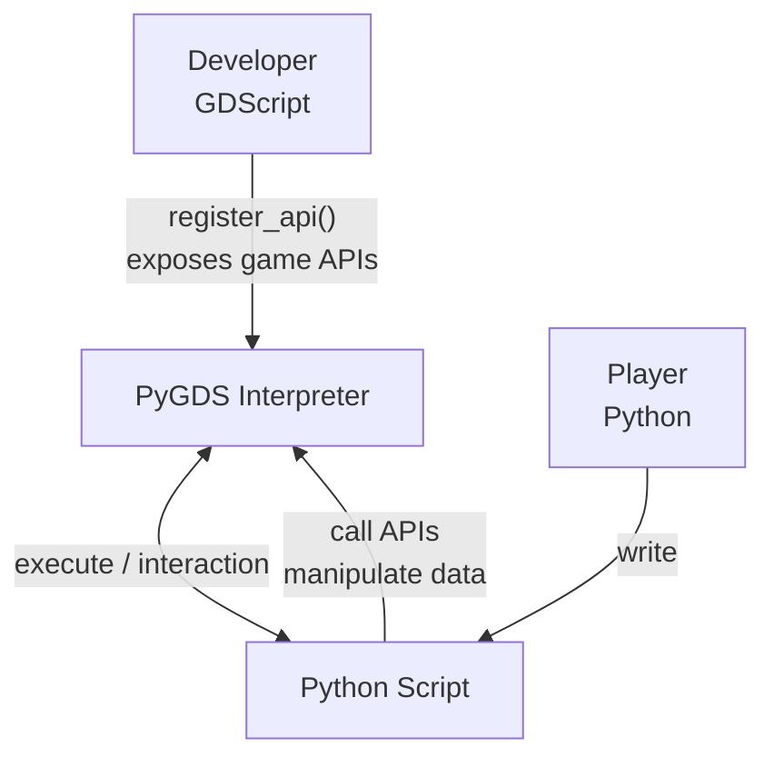

# PyGDS — Python Runtime Simulator for Godot

A Python 3.x subset interpreter implemented in GDScript, enabling Python-like script execution on all platforms that support GDScript

> 如果您需要阅读中文文档，请访问 [README.md](./README.md)

---

## Design Philosophy

PyGDS is an embedded scripting engine, **NOT a GDScript replacement.**

Its purpose is: **enabling "players" to interact with game data and behavior using Python syntax**, while "developers" expose game system APIs to scripts via `register_api()`.


```mermaid
flowchart TD
    A[Developer<br>GDScript] -->|"register_api()<br>exposes game APIs"| B[PyGDS Interpreter]
    B <-->|execute / interaction| C[Python Script]
    C -->|call APIs<br>manipulate data| B
    D[Player<br>Python] -->|write| C
```

**What PyGDS does:**

- Provide Python-syntax scripting for games (variables, functions, classes, control flow, exceptions)
- Allow non-developers to manipulate game data and configure game logic with familiar Python syntax
- Serve as a scripting engine for mod systems, enabling players to write custom behaviors

**What PyGDS does NOT do:**

- Replace GDScript for core game logic — core logic remains in GDScript
- Provide a full Python standard library — only basic types (`str`/`list`/`dict`) and a few built-in functions
- Support `import`/module system — scripts are standalone single files
- Support `async`/`await`/`yield` — The game script interaction is synchronous, but it provides a suspended system

---

## Quick Start

PyGDS is a GDScript class that inherits from `Node`.

Instantiate it, pass code via `write_dsl_script()`, then call `run()` to execute.

```gdscript
extends Node

func _ready() -> void:
    var dsl = PyGDS.new()

    # Terminal output won't print to Godot console in non-debug mode
    dsl.set_debug_mode(true)

    dsl.write_dsl_script("""
print("Hello, PyGDS!")
info("This is an INFO log")
warn("This is a WARN log")
""")
    dsl.run()

    # Get terminal output and logs
    print(dsl.print_output)
    print(dsl.console_output)

    # Adjust log level
    dsl.set_log_level(PyGDS.ConsoleReport.Level.WARN)
    print(dsl.console_output)  # Only WARN level and above
```

---

## Installation & Integration

PyGDS offers two ways to integrate:

### Single-file integration

All of PyGDS's core code lives in a single file, [pygds.gd](./pygds.gd), with no external dependencies.

1. Copy `pygds.gd` into your Godot project (any location, project root recommended)
2. The `class_name PyGDS` at the top of the file is auto-registered as a global class; no extra setup needed
3. Use it via `PyGDS.new()` or `load("res://pygds.gd").new()`

```gdscript
var dsl = PyGDS.new()
dsl.write_dsl_script("print('Hello!')")
dsl.run()
```

### Drive-letter virtual sandbox (optional)

To let scripts read and write files or load in-drive modules, pass a drive letter and an access switch at instantiation; the script-visible space converges into `user://<base_path>/<drive>/` with zero contact with the real file system:

```gdscript
var dsl = PyGDS.new("MOD1", true)
dsl.write_dsl_script("print(open('data.txt').read())")
dsl.run()

dsl.load_dsl_script("main.py")   # read the main file from the drive (multi-file mod scenarios)
dsl.run()
```

See the "Drive-Letter Virtual Sandbox" section of [usage.md](docs/en/usage.md) for the four drive/access combinations, the path rules and the `base_path` root.

---

## Python Compatibility Matrix

| Feature | Support | Notes |
| :--- | :--- | :--- |
| Variable Assignment | ✅ Full | Regular, multi-assignment, unpacking |
| Integer (`int`) | ✅ Full | All operators: +, -, *, /, %, **, etc. |
| Float (`float`) | ✅ Full | Same operator support as `int` |
| String (`str`) | ✅ Full | Common methods: `upper`/`lower`/`split`/`join`, etc. |
| List (`list`) | ✅ Full | All methods: `append`/`extend`/`pop`/`sort`, etc. |
| Tuple (`tuple`) | ✅ Full | Immutable sequence |
| Dictionary (`dict`) | ✅ Full | Methods: `items`/`keys`/`values`/`get`/`pop`, etc. |
| Boolean (`bool`) | ✅ Full | `True`/`False`/`None` singletons |
| `if`/`elif`/`else` | ✅ Full | Including ternary operator (`a if cond else b`) |
| `while` loops | ✅ Full | Including `break`/`continue` |
| `for` loops | ✅ Full | Iteration over list/tuple/string/dict |
| Function Definitions | ✅ Full | Regular functions, default args, `*args`, `**kwargs` |
| Class Definitions | ✅ Full | Inheritance, method overrides, instance attributes |
| Static Methods | ✅ Full | `@staticmethod` decorator |
| Class Methods | ✅ Full | `@classmethod` decorator |
| Exception Handling | ✅ Full | `try`/`except`/`else`/`finally`/`raise` with custom exception classes. exception groups (`ExceptionGroup` / `except*`, PEP 654) fully supported |
| `is` / `is not` | ✅ Full | Identity operators |
| `id()` | ✅ Full | Object identifiers |
| `global`/`nonlocal` | ✅ Full | Variable scope declarations |
| List Comprehensions | ✅ Full | `[x for x in iterable [if cond]]` |
| Generator Expressions | ✅ Full | `(x for x in iterable [if cond])`, lazy generator, supports `next()` and bare `sum(x for x in ...)` |
| Dict Comprehensions | ✅ Full | `{k: v for k, v in ... [if cond]}` |
| Set Comprehensions | ✅ Full | `{x*x for x in iterable [if cond]}` |
| Multiple `for` clauses | ✅ Full | `[x*y for x in a for y in b]`, each `for` may carry several `if`; list/dict/set comprehensions and generator expressions all support it, loop variables may be `k, v` tuple targets |
| Literal `*` unpacking | ✅ Full | `[*a, *b]` / `[1, *mid, 2]` / `(*a,)` / `{*a, 1}` (Python 3.5+) |
| Assignment expressions (`:=`) | ✅ Full | `if (n := len(a)) > 5:`, `while chunk := read():`, binds to the enclosing scope inside comprehensions (Python 3.8+); matching CPython, both "rebinding a comprehension iteration variable" and "appearing in a comprehension iterable expression" are rejected |
| `slice` | ✅ Full | `slice(start, stop[, step])` object, reusable indexing `lst[slice(...)]` |
| Augmented Assignment | ✅ Full | `+=` `-=` `*=` `/=` `**=` `//=` `%=` `\|=` `&=` `^=` `<<=` `>>=` all supported |
| Subscript Access | ✅ Full | `obj[key]` with `getitem`/`setitem`; slice assignment/deletion `a[1:3] = [9]` / `del a[1:3]` |
| Attribute Access | ✅ Full | `obj.attr` with `getattr`/`setattr` |
| Method Type System | ✅ Full | 7 types strictly matching CPython |
| Descriptor Protocol | ✅ Full | `__get__` implementing class-level/instance-level binding |
| Magic Methods | ✅ Full | `__add__`/`__str__`/`__init__`, etc., registered at class level |
| Operators | ✅ Full | Binary/unary/comparison/augmented all supported |
| f-string | ✅ Full | `f"value: {x:.2f}"`, with format specifiers, conversion flags, the `=` debug specifier and nested format widths, plus same-quote nesting and nested f-strings (PEP 701, Python 3.12+); replacement-field expressions support multiple lines (indented continuations and comments included) |
| lambda | ✅ Full | Anonymous functions with default arguments and closures |
| `super()` | ✅ Full | Call parent methods/constructors under single inheritance |
| `getattr`/`setattr`/`delattr`/`hasattr` | ✅ Full | Built-in reflection functions |
| `map()`/`filter()` | ✅ Full | Built-in functional tools |
| Runtime error line numbers | ✅ Full | Uncaught exceptions include `(line N)` |
| Number literals | ✅ Full | `0x1F` / `0o17` / `0b101` / `1_000_000` / `1e5`; `int("ff", 16)` parses in a base |
| Call-site `*`/`**` unpacking | ✅ Full | `f(*args)` / `f(**kwargs)` |
| Dict merge | ✅ Full | `d1 \| d2` / `d1 \|= d2` / `{**a, **b}` (Python 3.9+) |
| `str` `%` formatting | ✅ Full | `"%s: %d" % (x, y)` (printf style) |
| `str.format` | ✅ Full | `"{:.2f} {:>8}".format(x, s)`, with positional/keyword arguments and format specifiers |
| Built-in modules | ✅ Full | `import math` / `from math import sqrt` (math/random/statistics/functools/itertools/collections/string/operator/time/sys; math has comb/perm/prod/lcm/cbrt/remainder, random has choices/gauss, statistics has quantiles, functools has cmp_to_key, itertools has repeat/cycle/count/zip_longest/takewhile/dropwhile/accumulate/pairwise/groupby/starmap, operator exposes operator functions plus itemgetter/attrgetter/index, collections has Counter/defaultdict/namedtuple/deque/OrderedDict, sys provides version_info/maxsize/byteorder/platform/argv/intern/exit, time provides sleep/time/time_ns/monotonic/perf_counter) |
| `set` | ✅ Full | Literal `{1, 2}`, constructor, set operations and methods |
| `frozenset` | ✅ Full | Immutable set, hashable, supports set operations and comparisons |
| `bytes` type | ✅ Full | `b"xy"` literals and the `bytes()` constructor (zero-filled integer / iterable / string encoding / copy); method family `decode` / `hex` / `upper` / `lower` / `title` / `strip` family / `split` / `replace` / `find` / `index` / `count` / `startswith` / `endswith` / `join` / `center` / `ljust` / `rjust`; indexing/iteration yield integers, plus slicing, repetition and `in`, strictly distinct from `str` |
| `range` type | ✅ Full | A distinct lazy `range` object supporting `len` / indexing / slicing / containment / iteration without materialising large ranges |
| Multiple assignment targets | ✅ Full | `a[0], a[2] = a[2], a[0]`, `o.x, o.y = 1, 2`, including chained suffixes like `self.data[k] = v` |
| `dict` views | ✅ Full | `keys()` / `values()` are iterable and support `len` and `in` |
| `match`/`case` pattern matching | ✅ Complete | Soft keywords; literal / capture / wildcard / sequence (star and bracket-less forms) / mapping (with `**rest`) / class (`__match_args__` and built-in single-position binding) / or / `as` / guard / nested patterns all supported, with compile-time checks aligned to CPython |
| Multiple Inheritance | ✅ Full | `class C(A, B):` resolves along the C3 linearization (MRO), visible via `__mro__` / `mro()`; MRO conflicts, duplicate bases and layout conflicts raise `TypeError` matching CPython; `super()` (zero-arg and two-arg) cooperates along the MRO, with diamond `__init__` chains running exactly once per class |
| `async`/`await` | ✅ Practical Subset | Option-C coroutine-object emulation (driven synchronously, no event loop): `async def` calls return coroutine objects (send/throw/close, qualified-name repr), `await coro` drives to completion and takes the return value, user `__await__` delegation; `async for` / `async with` use the `__aiter__`/`__anext__`/`__aenter__`/`__aexit__` protocols; the `aiter` / `anext` builtins are available; unstarted coroutines get a never-awaited warning at script end. Async generators (`yield` legal, with `asend`/`athrow`/`aclose`); the `aiter` / `anext` builtins are available; unstarted coroutines get a never-awaited warning at script end. Established boundaries: `yield from` and await in comprehensions are unsupported, `import asyncio` remains unavailable, async scenarios are still replaced by the suspension system |
| `raise ... from` exception chaining | ✅ Full | `__cause__` and `__suppress_context__` fields readable, `from None` sets the suppression flag, bare exception classes and classes after `from` are auto-instantiated with no arguments; the implicit `__context__` chain and chained traceback printing for uncaught errors are not implemented |
| `__name__` / `__file__` | ✅ Full | `__name__` is always `"__main__"` (reassignable), the entry guard works; `__file__` defaults to an empty string and the host injects it via `set_script_path()` before `run()` |
| Generic type parameters and `type` aliases | ✅ Syntax accepted | `class C[T]` / `def f[T](x)` / `type X = int` (PEP 695) are accepted as syntax with type semantics ignored; alias names are not bound to values |
| Generators/`yield` | ✅ Full | Generator functions (`def` containing `yield`); calling returns a lazy `generator` object without executing the body. Supports statement-level and expression-level `yield`, `yield from` delegation, `send` injection, `throw` / `close` (`GeneratorExit`), `StopIteration.value` (generator `return` value), generator methods, lambda generators (Python 3.12+), alternating and nested generators (including `time.sleep()` inside nested generators), full `send` / `throw` delegation through `yield from` (PEP 380, sub-generator catches first), and closures persisting across `yield` |
| Decorators | ✅ Full | Arbitrary callable-expression decorators (self-written / parameterised factories / stacked, applied to functions, methods and classes), plus the five built-in forms `@staticmethod` / `@classmethod` / `@property` (with getter/setter/deleter) ; functional `staticmethod(f)` / `classmethod(f)` / `property(fget, fset, fdel)` are also available |
| Complex type & `1j` literals | ✅ Full | Construction (numeric/string/two orders)/arithmetic (exact integer powers, polar for non-integer)/comparison/dict keys (`1+0j` shares key with `1`)/`abs` / `conjugate`; ordering and int conversion raise per CPython |
| `bytearray` | ✅ Full | Construction (length/bytes/int iterable/`str`+encoding), mutation (index & slice assignment, append/extend/insert/pop/remove/reverse/clear/copy), bytes interop; unhashable |
| `memoryview` | ✅ Pragmatic subset | One-dimensional B-format views: len/index/slice/iteration/`tobytes` / `hex` / `cast("B")` / `release`; bytes-backed views are read-only, bytearray-backed write through |
| `open()` file I/O | ✅ Pragmatic subset | Text/binary modes (`r`/`w`/`a`/`rb`/`wb`/`ab`), read/readline/readlines/write/writelines/close/seek/tell/flush and line iteration; paths follow the host FileAccess (relative paths resolve against the project root); `FileNotFoundError` / `UnsupportedOperation` are registered |
| `with` statement | ✅ Full | Context manager protocol (`__enter__` / `__exit__`), single and comma-separated multiple managers (entered in order, exited in reverse), `as` targets supporting names/tuple and nested unpacking/starred/attribute/subscript; a truthy exit value suppresses the in-flight exception; suspension replay never re-runs `__enter__`; `with open(...)` works. `contextlib` is not supported (see P1-71) |
| User-file `import` | ❌ Not Supported | Built-in modules only (math/random/statistics/functools/itertools/collections/string/operator/time/sys) |

> **⚠️ Breaking Change (v0.3.0)**: Generator expressions `(x for x in iterable)` have changed from "eagerly evaluated to a list" to "lazy generator object".
> Code that directly subscripts/`len()`s or calls list methods on a generator expression result will fail — convert with `list(g)` / `tuple(g)` first
> generators are one-shot iterators (re-iterating does not restart).
>
> **⚠️ Breaking Change (v0.4.0)**: `yield` is now a reserved keyword and can no longer be used as an identifier (variable/function name, etc.). Code that used `yield` as a name must rename it.
>
> **⚠️ Breaking Change (v0.5.0-alpha.1)**: `sleep()` has moved into the `time` module — use `import time` then `time.sleep(n)`. A bare `sleep()` no longer exists (matching CPython, which has no built-in bare `sleep` either).
>
> **⚠️ Breaking Change (v0.6.0-alpha.2)**: `str(e)` of exception objects now returns the message text (previously the exception type name, empty string for no args), `repr(e)` prints `TypeName('msg')`, and `e.args` returns the argument tuple; `type` is now a class object (`print(type)` prints `<class 'type'>`); a no-arg `dir()` returns only user-defined names and built-in type instances list their method names
>
> **⚠️ Breaking Change (v0.5.0-alpha.4)**: `async` / `await` are now reserved keywords and can no longer be used as identifiers (variable/function names, etc.). `return` / `break` / `continue` outside a function body or loop body now raise `SyntaxError` (previously ignored silently). Code using `async` / `await` as names must rename them.
>
> **⚠️ Breaking Change (v0.8.0-alpha.1)**: `with` is now a reserved keyword and can no longer be used as an identifier (variable/function name, etc.). Code that used `with` as a name must rename it.
>
> Known behavioural differences and missing features (`yield` resumption re-evaluating prefixes, `send` / `throw` not forwarded, multiple assignment targets, user-class iteration protocol, and so on) have moved to the **Known Differences & Limitations** section below

---

## Known Differences & Limitations

The following lists the known differences and limitations between PyGDS and CPython, grouped by cause into three families: **Issue (I IDs, language-core alignment gaps)**, **Design (D IDs, intentional alternative models)** and **Platform (P IDs, host-platform constraints)**; the ID rules and the full list live in the [Differences List](docs/en/differences.md). Issues are graded by priority: **I0 = silent wrong values** (most dangerous, fix first), **I1 = a clear error or a missing feature**, **I2 = an edge difference**; open entries were re-labeled to the new families in v0.8.0-alpha.7 (e.g. P1-8 → I1-8, P2-1 → D1).

### Priority 0 (I0, Silent Wrong Values)

The 10 P0 defects uncovered while finalising v0.5.0-alpha.5 (P0-3 to P0-12: nested-container equality, floor division and modulo for negative operands, escape-sequence decoding, sequence sorting, `min`/`max` `key`, slice `del`, `repr(None)`, `chr()`/`%c` range checks, `format` grouping, and the `iter(list)` live view) were **all fixed in v0.5.0-alpha.6**; see the corresponding section of `CHANGELOG`; P1-68 (augmented assignment `&=` `^=` `<<=` `>>=`), P1-69 (set operations on dict views) and P1-70 (`in` membership on `__getitem__`-only iterables) uncovered by the v0.7.0-alpha.7 audit were fixed in v0.7.0-alpha.8. P0-13 (silent wrapping for integers beyond the int64 range) was fixed in v0.6.0-alpha.7 to raise an explicit `OverflowError`, and upgraded in v0.8.0-alpha.5 to an **arbitrary-precision integer**: arithmetic and conversions beyond int64 are promoted to a big-integer representation automatically (shrinking back when results fit again), `hash(int)` aligns with CPython's modulo `2^61-1` algorithm, and `int` semantics now match CPython; index positions remain bounded (subscripts, repetition, `chr`, `bytes(n)`, `range` arguments raise per the CPython `Py_ssize_t` isomorphism) together with a performance ceiling (fluent within ten-thousand decimal digits), see the integer-range section of `docs/en/usage.md` for behavior. The v0.7.0-alpha.7 project-wide audit uncovered two new P0s (both unfixed): P0-28 (dead loop in `nonlocal` binding search — the interpreter hangs across multi-level closure chains, requiring the host process to be killed) and P0-29 (cross-container equality semantics: `[1] == (1,)` evaluates to `True`). P0-25 (class bodies only supporting three statement forms) was fixed in v0.8.0-alpha.5: class bodies now execute as full code blocks — expression calls, if / for / while, augmented assignment, del, try, import and annotations all take effect with name bindings landing in the class dict; method assembly, `__set_name__` / `__init_subclass__` hook order and in-body suspension replay all match CPython

### Priority 1 (I1, Clear Errors or Missing Features)

Items P1-1 to P1-6, P1-11, P1-14 and P1-16 to P1-18 were fixed in v0.5.0-alpha.3 to v0.5.0-alpha.5; P1-10 (`match` / `case`) was implemented in v0.6.0; P1-13 (re-evaluation of prefix subexpressions on `yield` resumption) was fixed in v0.5.0-alpha.7 to v0.5.0-alpha.8; P1-19 to P1-29 found by the same audit (implicit line continuation inside brackets, one-line compound statements, `try`/`else`, slice assignment, genexpr tuple elements, user-class subscript and conversion protocols, sequence ordering comparisons, `None` as a dict key, the `iter()` type name, and `hasattr`) were **all fixed in v0.5.0-alpha.6**; P1-33 (`raise ... from` exception chaining), P1-34 (arbitrary and parameterised decorators), P1-35 (`__name__`) and P1-39 (generic type parameter syntax) were fixed in v0.6.0-alpha.3; P1-40 (f-string same-quote nesting, PEP 701) was fixed in v0.6.0-alpha.4; P1-42 (multiple inheritance) was fixed in v0.6.0-alpha.5; P0-14 (`and` / `or` short-circuit), P0-15 (silent termination on augmented assignment), P0-16 (`del` with parenthesized tuple targets), P1-36 (`...` literal), P1-37 (`collections.namedtuple`), P1-44 (reflected operators), P1-45 (class-body scope), P1-46 (`super()` in properties), P1-47 (user-defined descriptors), P1-48 (`min` / `max` `default`), P1-49 (`__getitem__`-only iteration) were fixed in v0.6.0-alpha.6; P1-7 (the `with` statement and the context manager protocol, including the replay enter-marker for suspensions) was implemented in v0.8.0-alpha.1; P1-9 (`async` / `await`, option-C coroutine-object emulation, including the `aiter` / `anext` builtins) was implemented in v0.8.0-alpha.2 with established boundaries (`yield from` and await in comprehensions unsupported, `import asyncio` unavailable); P1-41 (`except*` exception groups) was implemented in v0.8.0-alpha.4 (parenthesized manager lists and async generators landed alongside; `contextlib` was evaluated and registered as P1-71, deferred); P1-72 (class-header keyword bases, the PEP 487 kw-forwarding form) was implemented in v0.8.0-alpha.6; see the corresponding section of `CHANGELOG`

The I1 open-item list was **cleared in v0.8.0-alpha.9**: I1-8 (user-file `import`) was removed with its implementation in v0.8.0-alpha.8 (`<name>.py` resolved directory by directory along `sys.path`, converging into the drive inside a sandbox); I1-32 (eval / exec / compile plus globals / locals / vars and the deep sys surface), I1-38 (custom metaclass machinery), I1-71 (the contextlib module) and I1-73 (user `__init__` on builtin type subclasses) were all fixed and removed in v0.8.0-alpha.8; see the corresponding sections of `CHANGELOG`

### Priority 2 (I2, Edge Differences)

The I2 open-item list was **cleared in v0.8.0-alpha.9**: I2-43 (the `__iter__` strict message) and I2-59 (remaining constructor kwargs) were fixed in v0.8.0-alpha.8; I2-38 (implicit close of discarded generators) was reclassified as Platform P5 after experiments; I2-58 / I2-41 (v0.8.0-alpha.7) and I2-60 / I2-61 / I2-62 (the suspension-replay gaps, v0.8.0-alpha.9) were all fixed and removed; see the corresponding sections of `CHANGELOG`

P2-2 (parse-error messages and function repr) and P2-3 (operator error messages) were fixed by the **v0.7.0-alpha.9** message-alignment effort (missing colon, unterminated strings, `min` / `max` / `round` / `math.factorial` / `math.comb` / `math.perm` texts, the `print >> x` migration hint, function and bound-method repr); P2-50 (`Stack underflow` log noise) is eliminated by the project setting `debug/settings/gdscript/max_call_stack=2047` (set it in host projects too, see the Platform entry P2); P2-51 (`ObjectDB` leaks at exit and `resources still in use`) was fixed in **v0.7.0-alpha.9** via the object registry + cycle-breaking reclamation (`cleanup()` API); P2-16 (the `@` matrix-multiply operator, full syntax chain with `@=` and `operator.matmul`), P2-37 (the cross-suspension ordering of `close()` upgraded to statement-level replay), P2-42 (non-class bases resolved as metaclass candidates forwarding the call message), P2-56 (integer constant-expression folding and interning) and P2-57 (same-type reflection skip) were fixed in **v0.8.0-alpha.6**; I2-58 (type-specialized constructor messages for `int()` / `str()`, the `str` decoding path and keyword arguments of the six type constructors) and I2-41 (the position error and `_Feature` object binding for `from __future__`) were fixed in **v0.8.0-alpha.7**

P2-45 (re-checked as a false positive), P2-46 (`%#o` and f-string `#` prefix layout), P2-47 (`%c` str argument), P2-48 (`.N` significant-digit semantics) and P2-49 (`casefold` full folding) uncovered by the v0.7.0-alpha.7 audit were fixed in v0.7.0-alpha.8

### Design-Layer Differences (Design)

| ID | Item | Details |
| :--- | :--- | :--- |
| D2 (was P2-4) | `hash` values differ from CPython (stable model by default) | PyGDS uses stable hash values for `hash(None)` etc. by default (reproducible across processes), while CPython hashes are process-randomised; the equality/hash-consistency semantics match. An alignment switch exists: set `stable_identity_hash = false` before `run()` to align with CPython 3.12's process randomisation |
| D3 (was P2-40) | Default step limit of 50000 | Exceeding it raises `RuntimeError: maximum step count exceeded` (`yield from` deep recursion and long scripts can hit it; CPython has no limit); hosts can adjust via `_config_max_steps` — a safety-valve design |

### Platform-Layer Differences (Platform)

| ID | Item | Details |
| :--- | :--- | :--- |
| P2 (was P2-52) | Engine VM call-stack hard limit of 2048 frames | Deep recursion combined with deep expressions makes the engine hard-abort the call chain with `Stack overflow`, silently losing the remaining output (CPython either completes or raises a catchable `RecursionError`); the GDScript frame depth of expression evaluation / parsing is not bounded by the call-depth limit |
| P3 | str literals cannot contain NUL | Godot's String cannot store U+0000 (it would be replaced with U+FFFD), so `'\x00'` / `'\0'` str escapes raise `SyntaxError` at decode time; bytes are unaffected (`b'\x00'` works) |
| P4 | `\N{...}` supports only the built-in name table | Godot has no Unicode name database; PyGDS ships about 200 names covering printable ASCII full names and common symbols (e.g. `\N{BULLET}',`\N{LATIN CAPITAL LETTER A}'). Names outside the table raise `SyntaxError: unknown Unicode character name` matching CPython's behaviour for unknown names |
| P5 (was I2-38) | Implicit close of discarded generator objects is unimplementable | At `NOTIFICATION_PREDELETE` time in Godot 4.x the script instance is already detached, so the refcount reclamation path cannot drive `finally` (measured in the alpha.8 second batch, the theoretical fix path was disproved); code needing cleanup should call `close()` explicitly; re-check if a Godot upgrade loosens this |
| P6 | Engine exit check lingers on the global class script resource graph | A self-referencing construction inside an inner class body (`X.new()` within class X's own methods) makes the engine retain the script's core class graph at exit and emit a warning; the triggering construction was avoided in v0.8.0-alpha.9 via a cross-class factory (exit warnings cleared), new inner classes should avoid that form; re-check if a Godot upgrade loosens this |

---

## Architecture Overview

PyGDS implements a complete interpreter pipeline:

```txt
Source Code (Python-like) → Lexer → Parser → AST → Interpreter → Execution
```

***Core Components***

| Component | Responsibility |
| :--- | :--- |
| **Lexer** | Scans source strings into a token stream, identifying keywords, identifiers, literals, operators, etc. |
| **Parser** | Recursive descent parser that builds an abstract syntax tree (AST) from tokens |
| **Interpreter** | Traverses AST nodes and executes them one by one, managing scope and runtime state |
| **DSLObject System** | Multiple runtime object types, all inheriting from DSLObject, with unified type lookup via the `klass` field (matching CPython's `PyObject.ob_type`). The `fields` dictionary (Python's `__dict__`, `null` = built-in types without `__dict__`) stores instance attributes, implementing Python's "everything is an object" semantics |
| **DSLClass** | Class system supporting inheritance, method overrides, `@staticmethod`, `@classmethod`, `@property`. DSLObject directly serves as instances (no separate DSLInstance layer needed), with a three-level naming convention: `_dsl_*` (internal fast path), `magic_*` (DSL magic method protocol), `builtin_*` (DSL built-in methods) |
| **PyGDS** | Main controller, integrating Lexer/Parser/Interpreter, providing the public API |

---

## API Registration

PyGDS supports registering GDScript functions as callable global functions in PyGDS scripts via `register_api()`.

```gdscript
extends Node

func _ready() -> void:
    var dsl = PyGDS.new()
    dsl.set_debug_mode(true)

    dsl.register_api({
        "my_func": func(args, kwargs):
            return PyGDS.DSLString.new("hello from GDScript!")
    })

    dsl.write_dsl_script("""
result = my_func()
print(result)
""")
    dsl.run()
```

`register_api()` accepts a `Dictionary` with function names (strings) as keys and `Callable` values. Registered functions can be called directly by name in PyGDS scripts.

---

## Suspend System

PyGDS provides a suspend mechanism that allows DSL scripts to pause during execution and resume when external conditions are met. This is a unique PyGDS feature not found in standard Python, suitable for game scenarios like delays, waiting for player input, and playing animations.

Two types of suspension:

| Type | Call Method | Use Case | Resume |
| :--- | :--- | :--- | :--- |
| SLEEPING | DSL calls `time.sleep(n)`, API functions call `request_suspend_sleeping()` | Known wait time | Timer fires, automatically calls `run()` |
| WAITING | API functions call `request_suspend_waiting()` | Unknown wait time | External sets `state = RUNNING` then calls `run()` |

The `run()` method returns a `State` enum value (`FINISHED` / `SUSPENDED_SLEEPING` / `SUSPENDED_WAITING` / `ERROR`), allowing external code to drive the execution flow.

```gdscript
var dsl = PyGDS.new()

# SLEEPING suspend auto-resumes via SceneTree.create_timer
# Set _sleeping_resume_callback for additional logic on resume
# (called before run() resumes execution; Timer always calls run(), callback is for extra logic only)

# WAITING suspend is triggered by API functions calling request_suspend_waiting()
dsl.register_api_pair("wait_for_confirm", func(_args, _kwargs):
    dsl.request_suspend_waiting()
)

dsl.write_dsl_script("""
import time
print("Start")
time.sleep(1.0)
print("Continues after 1 second")
wait_for_confirm()
print("Continues after manual resume")
""")

var state = dsl.run()
# state == PyGDS.State.SUSPENDED_SLEEPING, waiting for Timer
# When Timer fires, run() is called automatically, encounters wait_for_confirm() → SUSPENDED_WAITING
# External sets dsl.state = PyGDS.State.RUNNING then calls dsl.run() to continue
```

---

## Behavioral Tests

Behavior tests use **dual-end live comparison**: each run executes CPython and PyGDS once, side by side, and verifies that both behave identically according to the comparison semantics declared per case (`same_output` exact stdout match / `same_exception` exception class match / `same_error` exception class and message match). All cases live in [ci/cases](./ci/cases/); each `.py` file covers one responsibility — e.g. `module_math_sqrt` tests the single `math.sqrt` function, `comprehension_list` tests list comprehensions — the file name is the responsibility statement.

- Verdict matrix, naming registry, case authoring rules and the workflow for adding cases: [`docs/en/ci.md`](docs/en/ci.md)
- Per-case documentation: [docs/zh-CN/behavioral.md](./docs/zh-CN/behavioral.md) / [docs/en/behavioral.md](./docs/en/behavioral.md)

```cmd
godot --headless --path /your/project/path --script /pygds/path/ci/run_cases.gd
```

The runner auto-detects the CPython command (`python` first on Windows, `python3` first on Linux); dual-end comparison requires a local CPython installation.

### Adding Tests

After adding a case to [ci/cases](./ci/cases/), run `python ci/lint_cases.py` — it will point out missing documentation entries; the full workflow (header metadata → lint → add a behavioral.md entry → filtered run → full regression) is described in [`docs/en/ci.md`](docs/en/ci.md) under "新增用例流程" (case authoring workflow).

---

## Demo Tests

The `demo/` directory contains a complete demo scene for the suspend system. Open the scene file in the Godot editor to run it, visually demonstrating three suspend modes (passive, active, and active + on_resume callback) in a turn-based combat simulation.

---

## FAQ

### How do I load a script from a file?

It is recommended to write DSL code in standalone `.py` files (avoiding GDScript string escaping and Tab indentation issues). The usual way is to read the file yourself and pass it through `write_dsl_script`; with a drive passed at instantiation (e.g. `PyGDS.new("MOD1", true)`) you can load the main file directly from the sandbox drive via `load_dsl_script`, combining with in-drive `import` for multi-file mod scenarios:

```gdscript
func run_script_file(path: String) -> void:
    var file = FileAccess.open(path, FileAccess.READ)
    var source = file.get_as_text()
    file.close()
    dsl.write_dsl_script(source)
    dsl.run()

# Drive sandbox: the main file and module files live under user://<base_path>/<drive>/
var dsl = PyGDS.new("MOD1", true)
dsl.load_dsl_script("main.py")
dsl.run()
```

See the "Drive-Letter Virtual Sandbox" section of [usage.md](docs/en/usage.md) for the path convergence rules.

### How do scripts interact with scenes/nodes?

Expose nodes or game logic to scripts via `register_api()`. API functions are defined on the GDScript side and can capture outer variables (such as node references):

```gdscript
dsl.register_api_pair("move_player", func(args, _kwargs):
    var dx = args[0]._dsl_str()
    player.position.x += float(dx)   # player is a node reference captured outside the script
    return PyGDS.DSLNone.new(),
)
```

The script can then call `move_player(10)` to manipulate the scene node.

### Why don't I see `print()` output in the Godot console?

In non-debug mode, output is not printed to the console in real time; it accumulates in `dsl.print_output`. Call `dsl.set_debug_mode(true)` to make `print()` output directly to the console.

### Can scripts read player input or network data?

Yes. Expose GDScript-side capabilities to scripts via `register_api()`; asynchronous scenarios that need to wait are implemented with the suspend system (`time.sleep` / `request_suspend_waiting`) rather than Python's `async/await`.

---

## Detailed Documentation

| Document | Description |
| :--- | :--- |
| [architecture.md](docs/en/architecture.md) | Architecture details and execution flow |
| [method_type_system.md](docs/en/method_type_system.md) | Method type system (matching CPython) |
| [class_system.md](docs/en/class_system.md) | Class and instance system |
| [builtin_types.md](docs/en/builtin_types.md) | Built-in type details |
| [exception_system.md](docs/en/exception_system.md) | Exception system |
| [behavioral.md](docs/en/behavioral.md) | Behavioral tests per-case reference |
| [differences.md](docs/en/differences.md) | PyGDS-CPython differences list (Issue / Design / Platform families) |
| [usage.md](docs/en/usage.md) | Usage guide and API registration |
